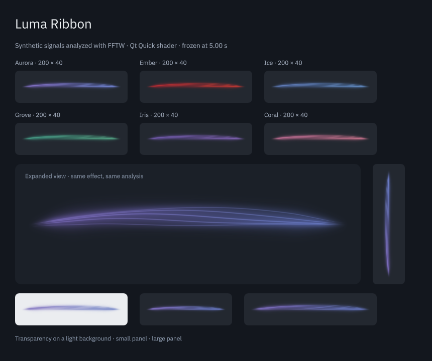

# Luma Ribbon

A music-reactive light ribbon for the KDE Plasma 6 panel, built with C++20, Qt Quick and native PipeWire capture.

**Experimental version 0.1.0.** Build and installation work on the tested Arch/CachyOS setup. Broader hardware testing and prolonged desktop use are still needed.



This screenshot is a native Qt Quick capture using synthetic audio analyzed by FFTW. The installed widget uses the real default-output monitor.

## What it does

- Draws a continuous transparent ribbon with soft light and fine filaments.
- Uses bass for thickness and a broad arch, mids for curvature, and highs for luminous detail. Short attacks produce small ripples and independent band accents.
- Changes its broad shape with the mix. Slow loudness and timbre changes also lift and lean the base, with shared state between panel and popup. Quiet passages settle; silence fades out.
- Provides Aurora, Ember, Ice, Grove, Iris, Coral and Hue palettes. Hue displays a complete spectrum at once. Optional audio-reactive colors stay within the selected palette.
- Adapts to horizontal and vertical panels, with 30/60 FPS limits, reduced motion and a simpler fallback renderer.
- Passively captures the monitor of the default audio output. It never selects a microphone, plays sound or changes volume or routing.

Click the panel ribbon to open an enlarged view. Multiple instances in one Plasma process share acquisition and analysis. The widget follows frequency activity in the mix; it does not identify or separate instruments.

## Validation status

See the [brighter core comparison](docs/brighter-core.md) and [slow base motion report](docs/slow-base-motion.md) for the latest rendering checks. Earlier reports cover [Grove](docs/grove-refinement.md), [Ember and Iris](docs/ember-iris-refinement.md), [palette behavior and Hue shift scope](docs/palette-behavior.md), [bloom](docs/bloom-control.md), [appearance controls](docs/appearance-controls.md), and [panel depth](docs/panel-depth.md). The [verification record](docs/verification.md) and [shared motion review](docs/shared-motion.md) retain earlier capture, recovery and sanitizer results.

Prolonged use in the actual panel, hardware hot-plug, physical Bluetooth timing and mixed-monitor scaling remain open checks. Historical reports describe earlier versions and must not be read as a current compatibility matrix. Local build logs and raw recordings are excluded from this repository; source tests, written results and selected screenshots are included.

## Requirements

- KDE Plasma 6 with a working Qt Quick scene graph; Qt 6.6 or newer.
- KDE Frameworks 6: CoreAddons, Config, Package, Kirigami, and KCMUtils.
- PipeWire 0.3.65 or newer and a session manager. WirePlumber 0.5+ is recommended and required by the optional isolated integration test.
- FFTW 3, single-precision library `fftw3f`.
- A C++20 compiler, CMake 3.22+, Extra CMake Modules 6, pkg-config, and Make or Ninja.

On Arch Linux and CachyOS, on an already configured Plasma desktop:

```sh
sudo pacman -S --needed base-devel cmake extra-cmake-modules \
    qt6-base qt6-declarative qt6-shadertools libplasma plasma-workspace \
    kconfig kcoreaddons kpackage kirigami kcmutils pipewire wireplumber fftw
```

The Qt development headers and QML modules are included in these packages. There is no CAVA, Python, WebSocket, terminal, or external audio process in the widget.

## Build and test

Clone the repository, then build from its root:

```sh
git clone https://github.com/Lucenx9/lumaribbon.git
cd lumaribbon
cmake -S . -B build -DCMAKE_BUILD_TYPE=Release -DCMAKE_INSTALL_PREFIX=/usr
cmake --build build --parallel
ctest --test-dir build --output-on-failure
```

The view and Plasma tests briefly open separate test windows. They do not change your panel. On a machine without a display, run the signal, queue and motion tests:

```sh
ctest --test-dir build -R '^(analysis|musical-response|color-response|motion)$' --output-on-failure
```

For a lean build, pass `-DBUILD_TESTING=OFF -DLUMA_BUILD_PREVIEW=OFF`. Shader Tools still compiles `ribbon.frag` into `.qsb` and embeds it in the native plugin.

## Install

```sh
sudo cmake --install build
```

Right-click your panel, choose **Add Widgets**, search for **Luma Ribbon**, and add it. CMake installs the native plugin, the Plasma package and its [ribbon icon](docs/widget-icon.md). Installing only the `package/` directory with `kpackagetool6` is insufficient.

On Arch/CachyOS the files go to:

- `/usr/lib/qt6/plugins/plasma/applets/org.kde.plasma.lumaribbon.so`
- `/usr/share/plasma/plasmoids/org.kde.plasma.lumaribbon/`
- `/usr/share/doc/lumaribbon/`

No session restart is needed for a first installation. To inspect the installed applet in its own window:

```sh
plasmawindowed org.kde.plasma.lumaribbon
```

When upgrading a native plugin already loaded by `plasmashell`, a process can retain the old library and compiled applet QML until the next login. Use `plasmawindowed` to verify the newly built version in a fresh process. Configuration pages use a separate engine and refresh when closed and reopened. Luma Ribbon does not restart the desktop session.

## Settings

| Setting | Behavior |
| --- | --- |
| Aurora, Ember, Ice, Grove, Iris, Coral | Six curated palettes with bounded hue ranges; Grove stays green, Iris violet, and Coral moves from pink to orange |
| Audio-reactive colors | Enabled by default; slowly shifts hue with the frequency balance. Disable for the original fixed gradient |
| Hue palette | All hues together along the ribbon, with a gentle audio-driven shift in their distribution |
| Hue shift | −180° to +180°, default 0°. Visible only for the Hue palette. Rotates its spectrum; the other six presets retain their original colors |
| Light intensity | Adjusts brightness without changing audio normalization |
| Curvature | 50–125%, default 100%. Scales the broad audio-driven curve without speeding up movement |
| Ribbon fullness | 60–130%, default 100%. Adjusts bundle thickness and filament spread |
| Bloom | 0–150%, default 100%. Adjusts the soft halo; 0% leaves only the filaments |
| Audio sensitivity | Scales the analyzed response after the absolute silence gate |
| Frame limit | 30 FPS by default; 60 FPS optional |
| Reduced motion | Holds the broad shape and procedural phase still and removes travelling ripples and short accent motion |
| Simple rendering | Uses a lightweight Canvas curve; automatic with software rendering or shader failure |

Reduced motion also follows Plasma's disabled-animation setting. Audio and rendering status appear in the configuration dialog. The panel remains a transparent ribbon without persistent error text. During silence, the empty panel space is still clickable.

The configuration dialog previews draft settings at the widget's actual panel size and orientation, using the same audio source. The preview stays visible when the controls scroll. During silence it waits for audio; it does not generate a demonstration signal. **Apply** saves changes to the panel and popup; **Cancel** discards them. **Reset appearance** restores palette, hue, audio-reactive colors, light intensity, curvature, fullness and bloom to their defaults. It leaves audio sensitivity, frame limit, reduced motion and simple rendering unchanged and still requires Apply.

Palette tints adapt to the theme's nominal background color: deeper colors on light surfaces, luminous colors on dark surfaces. This also applies to simple rendering and does not change the fade to silence.

The widget prefers 200 logical pixels along the panel and adapts to its actual thickness. A vertical panel rotates the same effect. Panel and popup share capture and analysis, as do multiple applets in the same `plasmashell` process. Each instance can use different visual settings.

## Uninstall

Remove all Luma Ribbon widgets from the panel and close its preview windows, then use the **same build directory used for installation**:

```sh
sudo cmake --build build --target uninstall
```

The target validates its install manifest and removes only Luma Ribbon's installed files. Empty directories can remain. The build directory and Plasma's saved widget configuration are not removed. If you installed through a package manager, use that package manager to uninstall instead.

## Verification tools

```sh
# Real audio, capture only; exits nonzero if no audible input was observed.
./build/luma-audio-probe --seconds 6 --expect-audio

# Same renderer and analyzer as the widget, in a separate window.
./build/luma-preview
./build/luma-preview --synthetic
./build/luma-preview --synthetic --reduced
QT_QUICK_BACKEND=software ./build/luma-preview --synthetic
QT_SCALE_FACTOR=1.25 ./build/luma-preview --synthetic

# Optional screenshot of the live Qt Quick window.
./build/luma-preview --synthetic --capture /tmp/luma-preview.png

# Reproducible frame for visual comparisons, frozen after 3 seconds of synthetic PCM.
./build/luma-preview --synthetic --at 3 --capture /tmp/luma-reference.png

# Optional: private PipeWire server, no hardware devices or desktop changes.
# Requires jq and the PipeWire/WirePlumber command-line tools.
bash tests/pipewire_integration.sh build
```

The isolated integration test creates two null outputs and an unrelated Audio/Source node, switches outputs, restarts its private policy manager, checks silence, removes outputs, restarts its own server, and checks reconnection and resource release. Its generated WAV is played only into private null sinks. It leaves logs in `build/evidence/`.

An optional [main-shape study](tools/macro-motion-prototype/README.md) preserves the earlier travelling-wave renderer beside the design candidate in a separate Qt window. Run `bash tools/macro-motion-prototype/run.sh`, or add `--synthetic` for its repeatable input study. It is excluded from normal builds and installation. The [design report](docs/macro-motion-prototype.md) records the original experiment; the applet now uses the [shared worker implementation](docs/shared-motion.md).

## Architecture, limits and evidence

See [architecture](docs/architecture.md), [verification results](docs/verification.md), [desktop settings and visual review](docs/desktop-review.md), [visual peer review](docs/visual-peer-review.md), [independent implementation reviews](docs/reviews.md), and the [official API references](docs/references.md).

Luma Ribbon is licensed under **GPL-3.0-or-later**. FFTW is a separately installed dependency under GPL-2.0-or-later; the project uses a compatible GPLv3 license. Qt, KDE and PipeWire retain their respective licenses. See [LICENSE](LICENSE).
