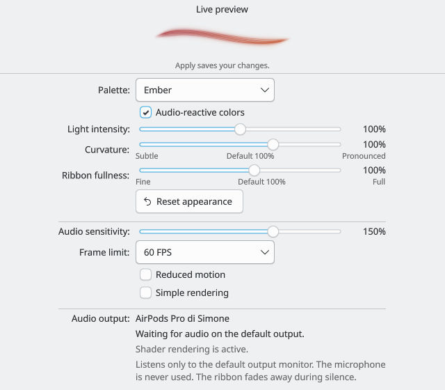

# Appearance controls

Date: 2026-09-06. Baseline: `ea56ea3`.

Curvature and Ribbon fullness let each widget adjust the ribbon's broad shape and thickness. Both default to 100%, preserving the preceding release's shape and opening. The new bounds are 50–125% for curvature and 60–130% for fullness, in steps of 5%.



This is a native Plasma configuration component in an isolated Qt test window. The screenshot holds a synthetic feature snapshot to make the controls visible without playing test audio. The shipped configuration page uses only the existing live output monitor.

## Interaction and design review

| Before | After | Why |
| --- | --- | --- |
| Broad curve and bundle width could only be changed in source. | Two bounded sliders, each with a named range and visible default. | Users can adjust shape without changing audio sensitivity or learning shader parameters. |
| Appearance changes required applying and inspecting the panel. | A preview follows the draft values during mouse dragging and keyboard input. | The result stays next to the controls, including when the form scrolls. |
| Reverting appearance meant remembering earlier values. | Reset appearance restores five visual settings, pending Apply. | Experimenting is reversible without changing audio or accessibility preferences. |
| Maximum curve, fullness and simultaneous attacks could carry the halo to the edge. | Both renderers keep an outer logical pixel clear and fade the remaining halo near the short edges. | The boundary does not leave a hard strip of clipped light. |

The preview uses the widget's current logical dimensions and orientation. A desktop widget uses a nominal 200 × 40 panel preview. An oversized preview scales down to fit the configuration width. The preview stops sampling when hidden or minimized, and no synthetic movement replaces silence. A missing or failed monitor directs the user to the audio status below.

Apply uses Plasma's normal configuration flow. Cancel discards draft edits. Reset appearance affects palette, audio-reactive colors, light intensity, curvature and fullness. Sensitivity, frame limit, reduced motion and simple rendering remain unchanged. The two new defaults do not overwrite existing saved settings.

When upgrading an already loaded native plugin, Plasma may keep its old shader resource and configuration schema until the next login. The settings page detects a plugin without `previewSize`, explains that login is required, and disables the new controls and Reset appearance until they can be applied correctly. A fresh `plasmawindowed` process can verify the update immediately.

## Implementation

`AppearanceControl.qml` keeps the two slider rows consistent while retaining native Qt Quick controls, keyboard handling and accessible names. `ConfigGeneral.qml` binds a third `RibbonView` to the applet's existing `AudioState`. Its `reportStatus` is false so testing a draft renderer does not overwrite panel diagnostics.

`LumaApplet.previewSize` transfers the main representation's logical size to the configuration engine. It is transient UI state, not a saved setting or an audio property. It defaults to 200 × 40 for compatibility with a previously loaded plugin.

The shader receives a per-view `appearance` uniform. Curvature scales the broad bend; fullness scales thickness, spread and filament core width. The Canvas renderer scales its matching curve and glow. QML clamps finite values to the same bounds as KConfig and replaces non-finite values with 100%. Capture, normalization, shared spring state, onset timing and palette definitions are unchanged.

Qt's [Slider documentation](https://doc.qt.io/qt-6/qml-qtquick-controls-slider.html) specifies continuous updates through `live`, step snapping and keyboard input. KDE's [configuration guide](https://develop.kde.org/docs/plasma/widget/configuration/) describes the `cfg_` properties and Apply/Cancel flow used here. The installed `KCM.SimpleKCM` implementation was also inspected to keep the preview in its supported header.

## Verification

- Build succeeds with Qt 6.11.2, Plasma 6.7.4 and GCC 16.2.1 on CachyOS. All 10 CTest suites pass.
- Native rendering passes 65 view and 60 motion-view QtTest entries, including 10 new appearance cases. Both suites also pass at 125% scaling.
- Software rendering passes 60 view entries with five intentional shader-only skips, plus all 60 motion-view entries. The Plasma configuration test passes with hardware and software rendering and at 125% scaling.
- The configuration test now waits for its own settings window to gain keyboard focus before testing arrow keys. This fixes a test failure caused by sending a key before Wayland activated that window.
- A separate compatibility fixture loads the previously installed native plugin and the new configuration QML. It confirms that the reload message is active and the new controls and appearance reset are disabled. It emits one Qt disconnect warning during teardown.
- QML lint completes with only the expected static warnings for the native applet's custom `audio` and `previewSize` properties. Whitespace checks pass.
- Local installation under `/usr` succeeds. All 58 installed files match the source or build output, and the installed native plugin passes the Plasma integration test in a fresh process. The existing `plasmashell` retains its previous library in memory until the next login; the session was not restarted.

The rendered appearance regression covers all four range corners at sensitivity 200% and intensity 160%, with simultaneous maximum accents. It uses PCM analyzed by FFTW and the production motion controller. Cases cover 160 × 32, 200 × 40, 240 × 48, 40 × 200 and 560 × 260, in both renderers. Assertions check visible output, clear edges, increasing curvature and width, repaint without another audio sample, exact return to defaults, invalid values, reduced motion and silence.

The Plasma integration test checks generated defaults, initial settings hydration, shared audio, independent draft values, mouse and keyboard updates, reset scope, persistence to a temporary configuration file, panel/popup propagation, hidden previews, actual vertical dimensions, independent widget settings and removal. It never writes the user's panel configuration.

Local logs and native captures are stored in `build/evidence/appearance-controls/`. No desktop or audio service restart is part of verification. Real hardware hot-plug, Bluetooth latency and prolonged listening were not repeated for these settings.

To repeat the checks:

```sh
cmake --build build -j 4
ctest --test-dir build --output-on-failure
QT_SCALE_FACTOR=1.25 ctest --test-dir build -R '^(view|motion-view|plasma)$' --output-on-failure
QT_QUICK_BACKEND=software ctest --test-dir build -R '^(view|motion-view|plasma)$' --output-on-failure
```
