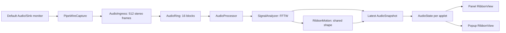

# Architecture

## Data flow

## Capture and routing

`PipeWireCapture` owns a PipeWire thread loop, context, core connection, registry, default metadata subscription and at most one input stream. It records only `Audio/Sink` nodes, then resolves `default.audio.sink` to one of those nodes. It targets the sink's unique `object.serial`, with `stream.capture.sink=true`, `node.dont-fallback=true`, `node.dont-reconnect=true`, `node.dont-move=true` and passive links.

Missing or invalid default metadata leaves the stream absent. An `Audio/Source` never qualifies as a target. The widget neither writes audio nor changes the user's default device, volume or playback state. PipeWire and the session manager remain the authorities for the graph.

Topology and stream-control callbacks run on the PipeWire control loop. The worker takes that loop's lock while maintaining the route, every 100 ms. Core disconnects tear down the connection and retry after a short delay. Metadata removal, sink disappearance and default output changes trigger a new stream. Shutdown stops the loop before releasing proxies and their listeners.

Initial or replaced metadata gets a neutral grace period of at most one second. A still-valid previous sink can remain connected during that brief wait; explicit removal or expiry closes capture. Stream teardown disconnects the data node before removing its callback listener, including on older supported PipeWire releases that do not synchronize hook removal themselves.

The stream explicitly negotiates interleaved native-endian `F32`, stereo FL/FR, with the rate left for negotiation. PipeWire converts the source sink layout/encoding as necessary. The accepted negotiated rate is 8–192 kHz; the analyzer uses the returned rate instead of assuming 48 kHz. Unsupported negotiation produces a configuration error, not an alternate source selection.

The audio callback validates the buffer, chunk offset, size, stride and corruption flag, then copies samples. Mapped float data is read with `memcpy`, so alignment is not assumed. All dequeued buffers are returned. A pathological quantum is limited to its newest 8192 frames. The callback has no heap allocations, mutex acquisition, logging, Qt signals, QML access or FFT. It performs one monotonic clock read per valid buffer to detect input gaps. On Linux this normally uses the vDSO clock implementation.

## Bounded transfer and cadence

`AudioIngress` accumulates small PipeWire quanta into fixed 512-frame blocks. This matters for low-latency graphs: a 64-frame quantum must not consume the same queue capacity as a 512-frame block. Incomplete blocks expire after a cadence-aware input gap, a state transition or a format change. Otherwise, stale samples could falsely light the ribbon when a suspended stream resumes in silence.

`AudioRing` is single-producer/single-consumer, using lock-free 32-bit atomics with release/acquire publication. The producer never advances the consumer index or overwrites an in-use block. A full ring drops incoming blocks and counts them. Sequence numbers expose a loss to the consumer.

The ring contains 8192 stereo frames, about 66 KiB including headers. The ingress holds one more 512-frame block. The worker drains at most 16 blocks per 10 ms iteration. There is no growing event queue and no queue of GUI frames. At 48 kHz the ring's maximum retained audio is about 171 ms. At 8 kHz it is about one second. Normal operation drains it every 10 ms.

`AudioProcessor` owns consumer cadence, missing-input decay and discontinuities. Its timeout accounts for both the negotiated sample rate and observed graph quantum. This avoids repeatedly clearing the FFT window when a valid low-rate callback interval exceeds 80 ms. Gaps clear spectral history while preserving smoothed levels and normalization. Missing input decays the output even if the device stops delivering zero-filled buffers.

Completed blocks also carry their monotonic callback receipt time. The processor uses the same clock and discards blocks older than `max(120 ms, 1.5 * (quantumFrames + 512) / rate)`, counting them separately from queue overflow. This bounds stale activity after a blocked worker while accepting normal large-quantum delivery. A long gap decays the old envelope before feeding fresh samples. Receipt time describes arrival at capture; it does not measure speaker or Bluetooth presentation latency.

## Analysis

`SignalAnalyzer` has no Qt or PipeWire dependencies. It uses a Hann window with a quarter-window hop. The window has 2048 frames up to 65536 Hz, 4096 up to 131072 Hz, and 8192 above that. Common 48/96/192 kHz rates therefore retain the same 42.7 ms window and 10.7 ms hop, instead of losing bass resolution at high rates. Two single-precision FFTs produce averaged spectral power. It does not sum left and right waveforms, so anti-phase stereo does not cancel. It removes each window's DC mean, rejects nonfinite samples and clips input values to a finite unit range.

| Output | Definition |
| --- | --- |
| RMS / peak | Linear levels after DC removal, before display normalization |
| Bass | Spectral power from 35 to 250 Hz |
| Mid | 250 to 2500 Hz |
| Treble | 2500 to 16000 Hz, limited by Nyquist |
| Energy | Smoothed, gated and normalized RMS |
| Spectral balance / treble share | Slow relative timbre descriptors for color, before display normalization; held below the gate |
| Accents | Positive spectral magnitude changes in each band, with a local frequency maximum, adaptive threshold and bounded envelopes |
| Attack / ripple age / origin | A shared travelling ripple triggered by a band accent, with a 160 ms refractory interval; age advances in the analyzer's sample clock, and origin is latched at the attack |

The gate is applied before normalization: closed below approximately −70 dBFS, fully open above −60 dBFS, with a smooth transition. The reference starts at 0.12 RMS, has a floor of 0.06, rises over 350 ms and falls over 12 seconds only while the gate is fully open. It is not adapted to silent background noise. Sensitivity is applied after this gate by each applet.

Attack/release smoothing uses elapsed sample time. Energy releases over 480 ms, bass 380 ms, mids 320 ms, treble 240 ms, and travelling-ripple strength 190 ms. These sustained levels retain their previous normalization and smoothing.

For accents, the analyzer blends each previous magnitude toward the maximum of that bin and its two immediate neighbors. The neighbor influence is `min(1, 0.012 * frequency / binWidth)`. This softens the filter at low pitches, where a whole FFT bin could hide a semitone, while restraining small vibrato. Positive differences are combined by root-sum-square separately in the three bands. An absolute threshold, a 250 ms symmetric exponential novelty mean and a slowly released band reference suppress stationary texture and weak noise. Unlike a fast-rise/slow-release peak follower, this mean falls between dense notes. The same absolute silence gate still applies. This is a small spectral-flux detector, not the full SuperFlux algorithm or an instrument separator. See [references](references.md).

Each band has an independent 90 ms interval for requesting a shared ripple. Its visible accent can still rise during that interval. Peaks decay over 65/45/35 ms for bass/mid/treble; visible envelopes rise over 12 ms and release over 85/65/50 ms. The shorter mid/treble tails preserve contrast in fast sequences while the bass remains softer. The shared ripple has a separate 160 ms interval to avoid repeatedly resetting the whole wavefront. Its age comes directly from the analyzer, so a weaker new attack does not depend on a GUI/worker comparison with an earlier envelope. A discontinuity clears novelty history and accents while retaining sustained levels; the first new spectrum establishes a reference without a false attack.

All signal features sent to the renderer are finite and bounded to [0, 1], and ripple age to [0, 10] seconds. Arrays are bounded by the maximum 8192-frame window. The analyzer object occupies about 192 KiB on the measured build, excluding FFTW's plan storage. Ordinary analysis adds no heap allocation or audio callback work. A format change prepares one replacement FFTW plan on the worker, retaining the previous plan if allocation fails. Plan creation/destruction uses a process-local mutex because FFTW's planner is not thread-safe. Separate FFT executions remain in their worker.

Color uses relative spectral amplitudes before normalization. The analyzer weights bass, mids and treble by 1, 1.8 and 3 so quieter upper frequencies remain visible in a bass-heavy mix. Their weighted positions are 0, 0.65 and 1. The average follows changes over 350 ms; the weighted treble fraction follows over 550 ms. These are exponential time constants, not fixed animation durations. Both update only above the fully open silence gate. Below it, during missing-input decay, and across a discontinuity, they retain their last values. Band release times therefore cannot produce a false hue sweep during silence. Reset restores a neutral balance of 0.5 and zero treble share.

## Ownership and rendering

`RibbonMotion` accepts normalized analyzer features and elapsed seconds, returning a `RibbonShape`. It has no Qt or PipeWire dependency. The worker owns one instance and publishes arch, counter-bend, horizontal bias and filament opening with the same features and phase. Relative band envelopes choose the broad shape; energy and mid changes against slower memories add phrase response. Four critically damped states retain position and velocity when their targets change. No timer chooses shapes and no random motion is added.

The worker advances this state every iteration, independently of GUI sampling, frame limit, visibility or per-applet sensitivity. Each step is limited to 100 ms after a stall. Below energy 0.002 it holds the current shape and clears velocity, while the normal energy envelope fades the ribbon. New views read the current snapshot immediately. Initialization failure destroys the motion state with the rest of the pipeline. See [shared motion verification](shared-motion.md).

Each `LumaApplet` owns one `AudioState`. Its `shared_ptr<AudioEngine>` acquires a process-local weakly held engine. Multiple applets in the same process share one capture stream, one analysis worker and the latest snapshot. Deleting the final owner joins the worker and releases capture resources. Different processes, such as `plasmashell` and the preview tool, necessarily have separate engines.

An analysis initialization exception produces a configuration error and a five-second retry. The partial pipeline is destroyed before retrying. The backoff checks for stop requests every 100 ms, so final-owner removal remains responsive. This handles recoverable initialization failures; it cannot guarantee recovery from process-wide memory exhaustion or a fatal error inside a dependency.

The worker replaces one mutex-protected `AudioSnapshot`. The GUI only copies that snapshot; the realtime thread never touches its mutex. Each `RibbonView` polls it at the selected frame limit. Hidden views and hidden/minimized windows stop their timers. Fully silent views check for new audio every 120 ms without changing shader properties or repainting an unchanged frame. The audio worker remains active while any applet exists so newly visible views have current data.

The engine is a QObject acquired and released on the GUI/event-loop thread. When energy rises above 0.002 after falling below 0.0005, it publishes the snapshot and queues a wake-up to its owning thread. An atomic flag permits at most one pending event for all instances. That event carries no frame and emits `audioAvailable` through each `AudioState`; visible dark views immediately read the latest snapshot. The idle timer remains as a compatibility and faint-signal fallback. Final-owner destruction joins the worker before QObject removes pending callbacks. Tests cover a blocked GUI, repeated starts, two states and destruction with a pending wake-up.

The existing 17/34 ms display timer remains after a measured `FrameAnimation` experiment produced less regular frame swaps on the tested desktop. Details and the experiment's scope are in [timing and response](timing-response.md).

`qt_add_shaders` prepares the fragment shader into a `.qsb` resource at build time. Qt Quick supplies the vertex shader and maps the uniform properties. The ribbon combines a soft veil with five filaments, one palette, the shared broad shape, a small audio-driven procedural drift and a short attack wavefront. Output is premultiplied alpha, including `qt_Opacity`. The longitudinal coordinate rotates for vertical panels; layout and width calculations use logical pixels for fractional scaling.

The broad path combines an anchored parabolic arch and a counter-bend along a horizontally biased coordinate. A procedural displacement provides continuity, bounded to 0.72 logical pixels at 40 px height. Filament opening follows the shared shape instead of a separate periodic fold. Shader and Canvas use the same broad centerline and independent mid-accent deformation. Canvas intentionally omits the travelling ripple and individual filaments. A previously loaded native plugin without shape fields gets a gentle fixed form until the next normal reload.

Five locally stored strand positions determine the weighted center of the veil. Veil and filaments share one longitudinal color progression. Their width and spread taper gently at the ends, and the central filament has more weight than the outer ones. A rounded distance at the attack origin prevents a sharp crease where the two waves meet. These computations remain bounded within the existing fragment pass.

At each new ripple, the analyzer computes an origin from the squared strengths of eligible band attacks at positions 0.32, 0.50 and 0.68. That origin stays fixed throughout the ripple, including subsequent timbre changes and silence decay. It expresses spectral activity along the ribbon, not instrument recognition or left/right panning. Older loaded plugins without this field retain the legacy 0.46 origin.

Short band accents complement sustained motion. Bass accents briefly expand the bundle; mid accents bend its second curve; treble accents brighten small portions of the filament cores. They do not pulse the whole widget's opacity. The three envelopes travel together in one additional shader uniform. Simple rendering uses the same accents for width, curvature and core brightness. Reduced motion suppresses these extra transients while retaining the original gentle response to sustained audio.

The host passes Kirigami's nominal background color to `RibbonView`. Light backgrounds select deeper versions of the same six palettes in both renderers. This changes tint, not alpha or the audio gate. It does not sample the actual wallpaper behind a transparent panel.

With `dynamicColor` enabled, the view maps spectral balance from 0.3–0.9 through a clamped smoothstep. This gives mixed music a visible color range. Both gradient endpoints move together within the selected palette, opening from a 16% separation to 41% in mixed passages. Ice on light backgrounds opens only to 20% to retain small timbre changes in Canvas. The treble share adds at most 8% and 16% of the palette's pale tint to those endpoints. Typed QML colors feed the existing shader uniforms and Canvas gradient, with opaque color inputs and unchanged output alpha. There is no new shader pass, timer, animation queue or elapsed-time hue cycle. An older loaded native plugin without the new descriptors retains its fixed gradient. Disabling the setting also restores the original endpoint colors. Reduced motion keeps this slow color response and still suppresses travelling waves and accent motion.

`Palette.js` owns the palette names and dark/light colors shared by the settings, applet and preview tools. Saved indices remain Aurora 0, Ember 1 and Ice 2; Grove, Iris and Coral append indices 3, 4 and 5. It prepares a 65-entry OKLCH ramp from the two primary colors when the palette or theme changes. It interpolates lightness and chroma and follows the shorter hue arc. Any out-of-sRGB entries reduce chroma at fixed lightness and hue through a 12-step binary search. The exact original endpoint colors finish the ramp. Each view retains just its current table; there is no accumulating cache. Frame updates interpolate two neighboring entries and apply the existing small RGB highlight tint. Both renderers receive these same opaque endpoint colors. The shader's short longitudinal blend and filament highlights remain unchanged. See [perceptual color verification](perceptual-color.md).

The phase wraps at `200*pi` to preserve shader float precision during long playback. Both renderers use time coefficients in integer hundredths, making this a common period. If those coefficients change, the period and the pixel-based wrap regression must remain consistent.

Reduced motion fixes both the broad shape controls and procedural phase through conditional selections, removes travelling attack ripples and reduces displacement. Selecting these directly avoids interpolation roundoff depending on live state. Color, brightness and thickness still follow audio. The Canvas fallback uses eight nested, translucent strokes along one 64-segment curve to soften the halo without a blur. It is selected for Qt Quick's software backend, a shader compilation error, or the user's explicit setting.

The settings page uses `KCM.SimpleKCM` with a Kirigami form, percentage labels and explicit slider accessibility names. Its `cfg_` properties support Plasma's Apply/Discard workflow. It also accepts the generated `*Default` values passed by Plasma 6.7; the authoritative defaults remain in KConfig XML.

## First-version limits

- The FFT window spans about 43 ms at the common 48/96/192 kHz rates and 256 ms at 8 kHz. Very low-rate inputs still have coarser temporal response. The power-of-two window selection has discrete size changes at the documented thresholds.
- This is a music visualization, not a calibrated loudness meter, beat tracker, pitch tracker or instrument separator. Overlapping instruments can produce similar band responses. The onset detector can miss soft entries or respond to abrupt timbral changes; it has not been benchmarked against a labeled music corpus.
- Stereo conversion is delegated to PipeWire. Unusual surround channel routing, custom session-manager policy, bitstream passthrough and remote audio graphs need separate hardware validation.
- Default metadata must name an available Audio/Sink. No arbitrary output, configured-but-missing device, microphone or source fallback is attempted.
- Qt Quick visibility can stop work for hidden/minimized windows, but it does not reliably report complete occlusion by another window. A visible but covered panel can still update.
- Display refresh, compositing and timer granularity may result in slightly fewer than 30 or 60 rendered updates per second. Slow rendering never queues visual frames.
- The fallback preserves a quiet continuous ribbon with less detail than the shader.
- Runtime shader fallback detects the software backend and ShaderEffect errors; recovery from a complete scene-graph or graphics-device failure belongs to Qt/Plasma.
