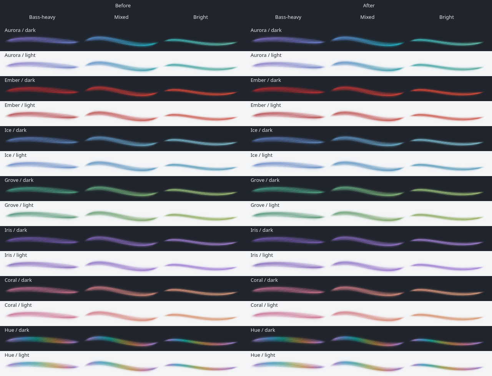

# Brighter central filament

Date: 2026-09-06. Baseline: `1cf6908`.

The central filament has more light to make the ribbon easier to read beside panel icons. Its width, color mixing and surrounding bloom retain their previous values.

| Before | After | Why |
| --- | --- | --- |
| Every shader core started with a light coefficient of 0.48. | The central core uses 0.64; the other four retain 0.48. | A brighter fine line gives the soft bundle more definition at panel size. |
| The Canvas core started at 0.64 opacity. | It starts at 0.72, with the same audio coverage and treble accent. | The simple renderer follows the stronger core treatment. |

These coefficients are not percentages of final screen brightness. The shader combines five filaments, halo and veil, then compresses opacity. The existing intensity and bloom controls still apply. Panel, popup and settings preview share the change.

The comparison uses identical snapshots from three generated PCM mixtures, passed through the production analyzer and motion controller. All seven palettes were inspected on dark and light backgrounds with both renderers at 100% scaling, and with the shader at 125%. The captured view sizes are 200 by 40 and 250 by 50 physical pixels respectively. The central line is more visible while the surrounding strands retain their separation.

The build and QML lint pass. The existing `view`, `motion-view` and `plasma` suites pass all 192 QtTest entries. They cover palette identity, accents, silence, reduced motion, bloom including zero, appearance limits, small and expanded views, vertical orientation, shared panel/popup state and applet removal. No test thresholds were changed. Live music and physical output switching were not repeated for this lighting change.

The installed native plugin passes the three Plasma test entries in a fresh process. All 74 installed files match the build and source. The running desktop still holds the previous plugin; it will use the new shader after Plasma restarts or the next login.

Local comparison captures and verification logs are under `build/evidence/brighter-core/`.
