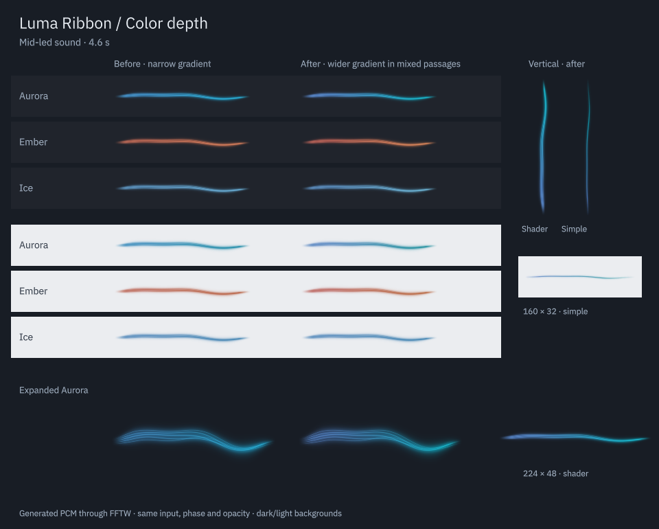

# Color depth

Date: 2026-09-05. Audio-reactive gradients now cover a wider portion of the selected palette during mixed passages. The refinement applies to the applet and to the separate main-shape prototype.

| Before | After | Why |
| --- | --- | --- |
| The dynamic gradient always covered 16% of the palette ramp | Its width grows smoothly to 41% around intermediate timbres | Violet, blue and cyan, or coral and amber, can coexist along the ribbon |
| A wider gradient reduced small-mix color changes in light-theme Ice with Canvas | This palette/theme combination opens to 20% | Preserve subtle timbre response on a light panel |
| The entire ribbon could read as one changing hue | The ends separate around the existing palette-coordinate midpoint | Add depth while retaining the direction of the audio response |

The existing timbre descriptor selects a balance `b` between zero and one. Each endpoint moves outward by `k * b * (1 - b)`, with `k = 0.5`, or `0.08` for Ice on a light background. The endpoint positions remain ordered, bounded and monotonic. At either extreme the added spread is zero, retaining the original bass-dominated and high-dominated colors. The midpoint in palette coordinates stays at `0.08 + 0.84 * b`. This does not imply identical perceived midpoint color after shader blending.

The change uses the existing cached OKLCH ramp and shared 350/550 ms timbre filters. It adds no capture work, timers, shader passes, settings or queued transitions. Fixed colors retain their exact previous gradient. Reduced motion retains the gentle color response. Silence holds the last hue while the ribbon fades.

The implementation changes [RibbonView.qml](../package/contents/ui/RibbonView.qml) and the matching color bindings in [PrototypeRibbon.qml](../tools/macro-motion-prototype/PrototypeRibbon.qml). The existing perceptual test now checks the widened endpoint position using its independent Oklab conversion. Its lightness, chroma and continuity tolerances, and all rendered visibility thresholds, are unchanged.

## Visual comparison

The native Qt comparison uses generated PCM through the existing FFTW analyzer. It includes all three palettes on dark and light backgrounds, 200 × 40 panels, vertical orientation, an expanded view and the simple renderer. The 14-second video is `build/evidence/color-depth/color-depth.mp4`. Its soundtrack is generated test PCM; the preview did not play it through the desktop output.

Aurora shows the clearest spatial separation. Ember gains a more visible coral-to-amber gradient. Ice remains restrained, particularly on a light panel. This pass changes the range visible along the ribbon, not the speed of color transitions.

## Verification

The normal project and optional prototype compile. The selected `view` and `plasma` CTest suites pass 2/2, comprising 41 view entries and three native Plasma entries. These cover palette choices, fixed mode, silence, reduced motion, opacity preservation, render cadence, hidden views, popup, shared audio, multiple instances and removal. The focused color/perceptual/theme selection passes 20/20 at 125% scaling and 20/20 with the software backend. QML lint is clean for both modified views.

The existing small-mix visibility threshold remains four channel levels per visible pixel. Light-theme Ice with Canvas measures 4.82 at normal scale and 4.72 at 125%. A wider initial candidate failed that threshold and was reduced before installation. These values are regression metrics rather than perceptual quality scores.

The final 420-frame native Qt comparison was rendered and sampled for visual inspection. The video is 14 seconds at 30 FPS, with generated PCM as its soundtrack. A separate prototype capture with `--synthetic --full --at 4.6` confirms the updated colors in both shape variants. A brief live-output preview remained transparent; it does not provide a playing-song color assessment. Evidence is retained in `build/evidence/color-depth/`.

The package was installed under `/usr` and compared with the source package and built native plugin. A fresh process using the installed applet passes all three Plasma test entries. A two-second read-only probe confirms the default Sunshine monitor is connected at stereo 48 kHz but silent, with zero errors, dropped or expired blocks, and successful resource release. The desktop Plasma PID remains 264298. No desktop or audio service was restarted. The running panel may retain earlier QML until a normal reload or login; a fresh `plasmawindowed org.kde.plasma.lumaribbon` process loads the installed update.

The audio sources and production fragment shader have identical before/after hashes. Capture recovery, routing and sanitizer checks from earlier passes remain historical. This color-only pass does not establish instrument separation, audible synchronization, physical monitor-scale transitions or compatibility with additional GPU drivers. The main-shape prototype remains excluded from installation.
