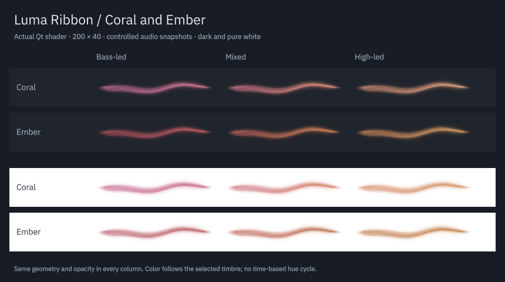

# Coral

Coral adds a pink-to-orange palette with a pale peach highlight. Its pink endpoint is cooler and lighter than Ember's red, and its orange endpoint is softer. Both palettes remain available as separate choices.

The comparison below records Ember before its subsequent [fire-red refinement](ember-fire.md). Coral's colors are unchanged.

| Before | After | Why |
| --- | --- | --- |
| Five palette choices | Coral appends saved index 5 | Preserve all existing selections |
| Ember supplies a red-to-amber gradient | Coral adds rose pink through peach orange | Provide the requested pink/orange identity |

| Background | First hue | Second hue | Highlight |
| --- | --- | --- | --- |
| Dark | `#e879aa` | `#ffab79` | `#ffe4df` |
| Light | `#b7467b` | `#c8753b` | `#efb6a2` |

Coral uses the same cached OKLCH interpolation, audio-selected gradient width, smoothed timbre, reduced motion and silence fade as the existing palettes. Fixed-color mode also works. No extra effect, timer, shader pass or audio analysis is added.

This is an actual Qt renderer capture at 200 × 40 using controlled audio snapshots. Every column has the same geometry and opacity. The comparison includes Ember to show the difference between the two warm palettes.

Select **Coral** in **Palette**. The shared catalog also makes it available in the standalone preview and the isolated main-shape prototype. The latter accepts `--palette 5`; add `--full` for audio-reactive colors. The prototype remains excluded from installation.

## Verification

The ten existing dark/light color triplets and all five previous names and saved indices match the preceding catalog. The normal project and optional prototype compile. The selected view and Plasma CTest suites pass 2/2, including 65 view entries and three Plasma entries. The configuration check selects all six names and verifies that each index reaches the panel and popup.

The existing color, perceptual interpolation, theme and settings cases now include Coral. All 50 entries pass at 125% scaling, and all 50 also pass with the software backend. Existing visibility, lightness, chroma and continuity thresholds are unchanged. Rendering QML lint has no warnings. Evidence is in `build/evidence/coral/`.

The dark/white comparison, six-palette standalone preview and prototype with `--palette 5 --full` were captured and inspected. The comparison uses controlled snapshots; the previews use generated PCM through the existing FFTW analyzer. No test sound was played through the desktop output.

The audio sources and production shader have unchanged before/after hashes. Backend recovery and sanitizer suites are not repeated for this palette addition, and no new live-song assessment is claimed.

The package is installed under `/usr` and matches source/build files. All three installed-app Plasma test entries pass in a fresh process, including all six palette selections. Desktop Plasma PID 264298 is unchanged; no session or audio service was restarted. The current panel can retain its earlier QML/configuration schema until a normal reload or login. A fresh `plasmawindowed org.kde.plasma.lumaribbon` loads Coral immediately.
