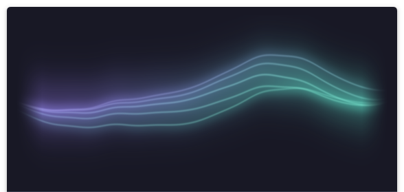
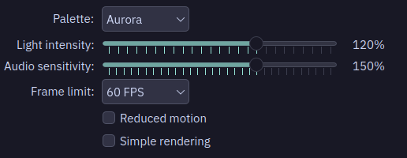
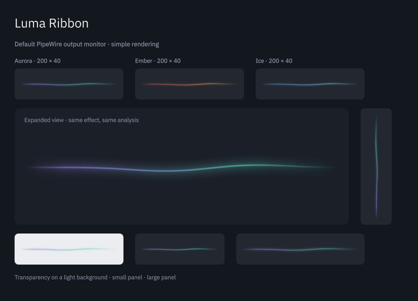

# Desktop settings and visual review

2026-09-05, CachyOS / Plasma 6.7.4 / Qt 6.11.2, Wayland. Spotify was playing through the default AirPods output. This review used the actual widget on the user's 46-pixel bottom panel, native pointer interaction, saved-setting readback, and Spectacle screenshots. Playback, output selection and volume were not changed.

## Findings and corrections

| Before | After | Why |
| --- | --- | --- |
| Very short sliders with no displayed values | Wider sliders, percentage labels and explicit accessible names in `package/contents/ui/ConfigGeneral.qml:32` | Intensity and sensitivity can be set precisely and checked at a glance |
| Configuration root rejected the host's title and generated default properties | `KCM.SimpleKCM` and the complete property contract in `package/contents/ui/ConfigGeneral.qml:9` | Native page layout, scrolling and clean initialization of this page |
| Three strongly separated strokes in the simple renderer | Eight faint nested strokes along one curve in `package/contents/ui/RibbonView.qml:102` | A softer halo without a per-frame blur or unbounded geometry |
| Reduced-motion phase used floating-point interpolation | Direct fixed-phase selection in `shaders/ribbon.frag:30` | At 125%, interpolation changed one color channel of one pixel by 1/255 when time changed. The exact pixel-equality regression now passes without increasing tolerance |
| Plasma tests could retain QML copied at configure time | Test package refreshed on each build in `CMakeLists.txt` | The integration test exercises the current source |

## Visual assessment

The shader ribbon reads as a continuous luminous shape at panel size. The restrained purple-to-mint palette and soft veil keep the filaments connected. In the popup, the individual curves become visible without turning into a bank of bars. The main shader's normal-motion appearance was retained; its only change in this review is the fixed phase under reduced motion.

Actual panel and popup, captured during Spotify playback:

Ember at minimum intensity and sensitivity is deliberately faint; Ice at maximum values is brighter but did not flash during the observed playback. Reduced motion holds the procedural shape while audio still controls brightness and thickness. The simpler renderer remains less detailed than the shader; its softer edges now fit the same visual style.

## Settings exercised on the actual desktop

| Control / interaction | Checked |
| --- | --- |
| Palette | Aurora, Ember and Ice, selected through the combo box and applied |
| Intensity | 40%, 100%, 120%, 160%; saved values read back |
| Sensitivity | 50%, 100%, 150%, 200%; saved values read back |
| Frame limit | 30 and 60 FPS |
| Reduced motion | Enabled and disabled, including high-intensity Ice |
| Simple rendering | Enabled and disabled; switching back restored the shader |
| Popup | Opened and visually inspected with the tested palettes and rendering modes |
| Apply and reopen | Settings persisted; repeated after installing the new configuration page |
| Discard | An unsaved intensity change was discarded through Plasma's confirmation dialog; the saved 120% remained |

The final saved values are Aurora, intensity 120%, sensitivity 150%, 60 FPS, reduced motion off, simple rendering off. The original panel widget IDs and order were preserved. No test windows were left open. Spotify remained playing and the original `plasmashell` process remained running.

## Automated checks and fresh rendering

The complete CTest suite passed **4/4**. The expanded view suite passed **11/11** on the regular backend, at `QT_SCALE_FACTOR=1.25`, and with `QT_QUICK_BACKEND=software`. Its cases cover all three palettes in both renderers, increased light at the intensity endpoints, sensitivity forwarding, fixed reduced-motion pixels, phase wrap, switching renderers, vertical layout, transparency, hidden-view suspension and silence. The software run exercises automatic Canvas fallback for both requested modes.

Observed GUI updates over 1.1 seconds were 32 at the 30 FPS setting, 64 at 60 FPS, and 65 for Canvas at 60 FPS. These are local update counts, not a guarantee of compositor frame presentation on every machine. The tests do not enqueue graphical frames.

The configuration regression first reproduced the missing-property failure, then passed with the actual title/value/default initialization contract. No audio acquisition or analysis code changed in this review; the earlier backend and sanitizer results are recorded in [verification](verification.md).

The new fallback was also inspected in a fresh compiled Qt preview using real PipeWire audio, including the vertical and light-background views below. Reduced motion was enabled for this capture.

## Practical limits

An already-running Plasma process can retain its loaded native plugin and compiled applet QML. The updated configuration page was verified directly in the running shell after reopening it. The new fallback and fixed shader were verified in fresh test/preview processes; the existing panel may retain their previous versions until the next normal login. The installation is updated. No session restart was performed to force a reload.

One nonfatal Qt message, `Created graphical object was not placed in the graphics scene`, still appears when the configuration page is created. The same message was reproduced on Plasma's own Keyboard Shortcuts page. Installed Kirigami `PageRow.qml` creates pages under a `QtObject` before inserting them into the visual column; this is consistent with that warning. Plasma's stock shortcut page also receives unrelated configuration keys. The widget's own missing-property warnings are resolved; no system framework files were modified.

This session did not change the real panel orientation or desktop display scale. Vertical layout and 125% scaling were covered by separate Qt/Plasma tests. Physical device hot-plug, mixed-DPI display transitions, panel auto-hide and overnight operation still need the hardware checks listed in [verification](verification.md).

Raw screenshots, saved-setting snapshots, before/after regression logs and final test logs are under `build/evidence/desktop-review/`. The selected images in this document are genuine captures, cropped only where indicated. The earlier external model reviews predate these small visual and configuration changes.

**Verdict: Approve for the first version**, with the hardware-validation limits above. No disruptive motion was observed in the tested playback. Hidden views stop graphical updates, reduced motion remains audio-responsive, and the fallback has a bounded rendering cost. The shader is the preferred visual experience.
