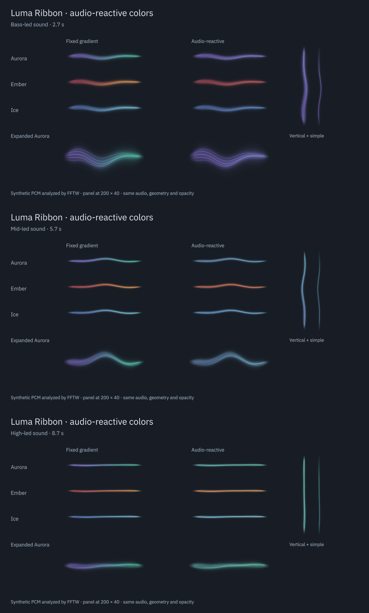

# Audio-reactive colors

Date: 2026-09-05. The palette now follows the frequency balance of the audio. The option is enabled by default, and disabling **Audio-reactive colors** restores the original fixed gradient.

This report describes the initial RGB interpolation pass. The subsequent [perceptual color refinement](perceptual-color.md) changes the interpolation to OKLCH while retaining the audio descriptors, smoothing, settings and alpha behavior described here.

| Before | After | Why |
| --- | --- | --- |
| The same longitudinal gradient remained on screen through every song section | Bass favors the first palette hue, mids move toward the second, and highs add a pale tint | Color now communicates changes in the mix |
| Treble accents changed brightness, but the palette itself stayed fixed | Slow shared timbre descriptors also change the two gradient endpoints | Sections can change color without turning each hit into a flash |
| Direct ratio mapping made changes in a full mix too subtle | A bounded smoothstep expands the useful color range; both endpoints travel together | The response remains visible at panel size while preserving palette identity |
| The first color pass was too subtle in Ice on a light background with Canvas at 125% | Increased the endpoint travel from 72% to 84% of the palette range | The measured small-mix change rose from 3.94 to 4.38 channel levels per visible pixel, without changing alpha |

Approve for this implementation and the tested Qt backends. The slow color response is intentional for an always-visible panel. It retargets continuously from the current analyzed value and does not overshoot or queue transitions. Reduced motion retains this gentle change while still suppressing travelling waves and short accent motion. The fixed-gradient option also remains available.

Implementation references are [shared timbre smoothing](../src/SignalAnalyzer.cpp#L141), [palette interpolation](../package/contents/ui/RibbonView.qml#L45) and [the configuration option](../package/contents/ui/ConfigGeneral.qml#L34).

## Appearance

| Palette | Bass-led sound | Mid/high-led sound |
| --- | --- | --- |
| Aurora | Violet | Green-blue with a pale mint tint |
| Ember | Coral red | Amber with a cream tint |
| Ice | Blue | Cyan with a pale blue tint |

These are actual Qt Quick captures from the same FFTW analysis, with identical geometry, opacity and phase in the two columns. The comparison includes 200 × 40 panels, enlarged views, vertical orientation and simple rendering. The 14-second recording in `build/evidence/dynamic-color/dynamic-color.mp4` uses locally generated PCM, including changing mixtures and a silence tail. It contains no recorded music from the user's output.

## Implementation

- `SignalAnalyzer` adds two bounded floats, `spectralBalance` and `trebleShare`. It derives them from relative spectral amplitudes before display normalization, with fixed weights of 1, 1.8 and 3 for bass, mids and treble.
- Their exponential time constants are 350 and 550 ms. They update only above the fully open silence gate and hold their last values through silence or a capture gap. A sustained tone settles to a color. It does not start an automatic cycle.
- `AudioState` exposes the shared values without sensitivity scaling. Color therefore does not jump merely because the display sensitivity or volume normalization changes.
- `RibbonView` interpolates within the selected theme-adjusted palette. The existing shader color uniforms and Canvas gradient receive the same endpoint colors. The shader's alpha, geometry, pass count and resource interface are unchanged.
- KConfig stores `dynamicColor`, defaulting to true. The settings page accepts both its value and the generated default. The compact and expanded views bind to the same setting.

There is no extra rendering timer, per-view color animation, growing frame queue or audio callback work. The descriptors add eight bytes to `Features`. Hidden views continue to stop their render timer. A newly opened popup reads the current shared state instead of beginning a separate transition. An older native library already loaded by Plasma has no new timbre fields and retains fixed colors until a fresh process loads the upgrade.

## Verification

- The new analysis regression checks 15 combinations of sample rate and frequency band, including anti-phase stereo. It checks finite values, bounded steps, stable sustained tones, volume invariance, noise rejection, silence, suspended input, discontinuity and reset. A timbre change becomes visible within one second without an immediate hue flash.
- View tests compare actual pixels for all three palettes, shader and Canvas, dark and light backgrounds, fixed/dynamic switching, smaller mix changes and reduced motion. Color changes preserve the alpha channel. Existing FPS, hidden-view, vertical, silence and phase-wrap tests remain in the suite.
- The native Plasma test checks the new default, setting propagation to panel and popup, and clicking the checkbox in a real rendered configuration page. Multiple-instance removal and popup checks remain active.
- The real-audio probe captured 20 seconds from the user's playing default HDMI output at stereo 48 kHz. Spectral balance ranged from 0.652 to 0.766, and treble share from 0.249 to 0.558. No errors or queue drops occurred. The probe released its shared engine after exit.

The regular CTest suite, instrumented backend suites, fractional-scale/software checks and final installation results are recorded in [verification](verification.md). Raw logs, screenshots, the generated PCM and per-frame descriptor trace are under `build/evidence/dynamic-color/`.

The rebuilt plugin, package and documentation are installed under `/usr`. The native Plasma test also passed against that installation in a fresh process. Its configuration page and a separate live-output preview were captured and inspected. The user's existing Plasma process and Spotify playback remained running.

## Limits

This tracks timbre in the mix. It does not identify an instrument, infer emotion, read cover art or synchronize color to a beat grid. A densely compressed passage with little spectral change can retain a similar hue. Ice deliberately spans a narrower hue range than Aurora. The fixed weights and visual mapping are aesthetic choices, not a calibrated auditory model.

The running desktop session was not restarted. A native plugin already loaded in the panel can remain cached until the next normal login; a fresh Plasma process can load the installed upgrade immediately. Actual desktop scale changes, other GPU drivers and prolonged use retain the hardware limits listed in the main verification record. Prior GLM and Gemini reviews cover earlier revisions, not this color pass.
