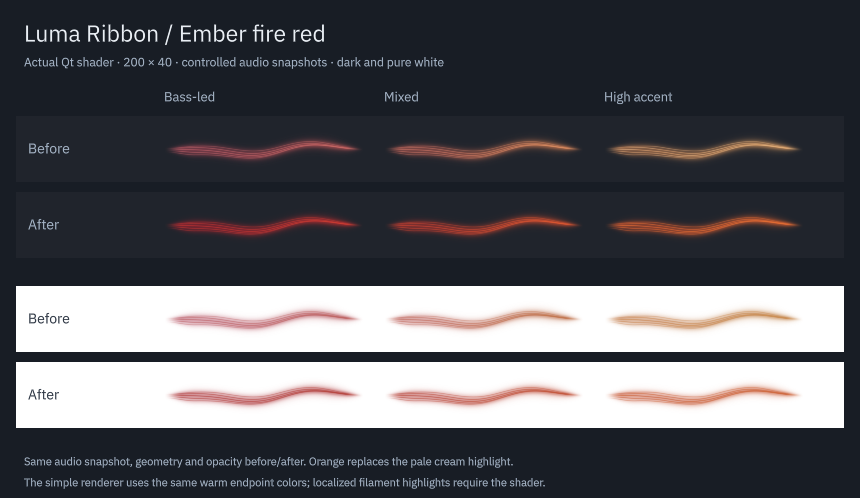

# Ember fire red

Ember now uses a fire-red body with orange highlights. Its two base colors run from deep red to vermilion, while the existing filament highlights use orange instead of pale cream. The light-background variant is deeper to preserve visibility on white.

| Before | After | Why |
| --- | --- | --- |
| Rose red to amber | Deep red to vermilion | Keep red as Ember's main identity |
| Pale cream highlights | Orange highlights | Give the bright details the requested fire color |
| First candidate's light colors missed the existing contrast target | Deeper light-theme red and vermilion | Retain readability on white without changing opacity |

| Background | First hue | Second hue | Highlight |
| --- | --- | --- | --- |
| Dark | `#d62532` | `#ff6530` | `#ff9a3d` |
| Light | `#9f1822` | `#be3f1b` | `#d9782d` |

The native Qt capture uses identical controlled audio snapshots, geometry and opacity before and after. Each ribbon is 200 × 40. The high-accent column exercises the existing treble level and treble-accent highlight. The simple renderer receives the same warm gradient endpoints; the shader supplies the localized filament highlights.

Only Ember's two color triplets change in the shared catalog. It remains index 1, and saved selections keep working. The other five palettes, names and indices are unchanged. Audio response, smoothing, interpolation, gradient width, rendering geometry and alpha behavior remain as before. The separate main-shape prototype reads the same palette catalog and remains excluded from installation.

## Verification

The normal project builds. All ten focused Ember test entries pass at normal scale, at 125% and with software rendering. These exercise dark/light interpolation, small and large timbre changes, fixed mode, reduced motion, silence transparency, theme contrast, intensity and sensitivity. Existing thresholds are unchanged. The first light-theme candidate failed the existing contrast check; the deeper final triplet passes it in both renderers.

The before/after comparison, generated-PCM six-palette preview and isolated prototype with `--palette 1 --full` were captured and inspected. The prototype captures also include 160 × 32, 240 × 48, expanded and vertical views. These are controlled or synthetic inputs, not a new playing-song assessment.

The other ten palette/theme triplets, all names and all saved indices match the preceding catalog. Audio sources and the production shader have unchanged hashes. Evidence is in `build/evidence/ember-fire/`. No backend recovery or sanitizer tests are repeated for this color-only change.

The source package and built native plugin match the installation under `/usr`. All three installed-app Plasma test entries pass in a fresh process. Desktop Plasma PID 264298 remains running; no session or audio service was restarted. The active panel may retain its preceding QML until a normal reload/login. A fresh `plasmawindowed org.kde.plasma.lumaribbon` process loads the updated Ember colors.
