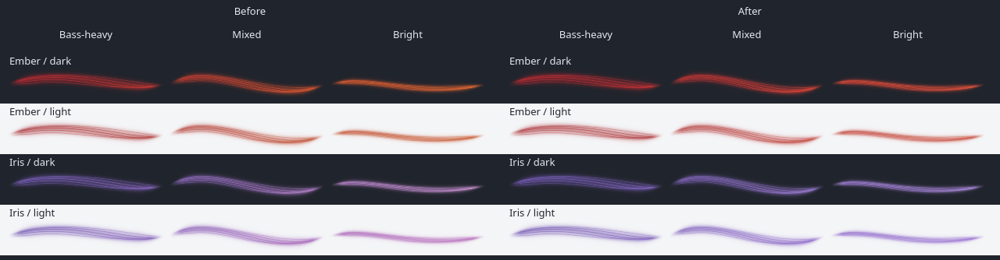

# Ember and Iris refinement

Date: 2026-09-06. Baseline: `4c15bf4`.

Ember keeps a red body as the mix becomes brighter, with orange filament highlights. Iris keeps a violet body and more violet in its highlights. The primary colors are unchanged, so bass-heavy passages remain close to their previous appearance. The adjustment applies to both fixed and audio-reactive colors, including the simple renderer.

| Before | After | Why |
| --- | --- | --- |
| Ember's secondary color pulled the whole body toward orange. | Its secondary color is a brighter red, with the existing orange highlight retained. | Keep the fire-red identity through treble-heavy passages. |
| Iris's secondary color approached magenta. | It approaches a lighter violet. | Retain the palette's violet identity as the audio changes. |
| Iris used very pale highlights. | Its highlights have more violet and less white. | Keep the filaments luminous without making the body look washed out. |

These are native Qt shader captures at 200 × 40, on dark and light backgrounds. Before and after receive identical snapshots from the existing FFTW analyzer and shared motion model. Each snapshot follows two seconds of stereo PCM mixing 100 Hz, 1 kHz and 6 kHz tones. The three amplitude triplets are `(0.16, 0.025, 0.008)`, `(0.12, 0.12, 0.055)` and `(0.04, 0.03, 0.13)`. The PCM is analyzed in memory and is not played through the desktop output.

## Implementation

Only the Ember and Iris color triplets in `Palette.js` change. Names, saved indices, the other palettes, Hue shift scope, shared interpolation, smoothing, geometry, shader code and audio processing retain their existing behavior. The palette table is still cached outside audio-frame updates. No setting, dependency or rendering pass is added.

| Palette / theme | Primary | Secondary | Highlight |
| --- | --- | --- | --- |
| Ember / dark | `#d62532` | `#ff453b` | `#ff9a3d` |
| Ember / light | `#9f1822` | `#bf2d29` | `#d9782d` |
| Iris / dark | `#8060cc` | `#b58bf0` | `#dcc0ff` |
| Iris / light | `#6140a8` | `#8657c9` | `#b89bdd` |

## Verification

A held renderer fixture combines a high spectral balance, full treble share, full treble level and a treble accent. It measures the alpha-weighted mean color of visible pixels. The regression requires Ember's body to remain in a red hue range and Iris's body in a violet range, with retained Iris chroma. These are design-specific guardrails, not universal measures of perceptual quality. All eight palette/theme/renderer cases failed the former colors and pass the refined colors.

| Shader fixture | Before hue | After hue | Before / after Oklab chroma |
| --- | --- | --- | --- |
| Ember / dark | 17.02° | 7.82° | 0.190 / 0.208 |
| Ember / light | 15.10° | 6.82° | 0.164 / 0.175 |
| Iris / dark | 288.71° | 264.62° | 0.121 / 0.138 |
| Iris / light | 293.42° | 264.51° | 0.151 / 0.157 |

The existing dynamic-color tests retain their thresholds. At normal scale, small-mix color changes range from 4.85 to 11.70 channel levels across the changed palettes, themes and renderers, above the existing threshold of 4. Large changes remain above 20, against a threshold of 12. These numbers are regression metrics, not percentages of visible improvement. The first light-theme Ember candidate missed the existing white-background contrast check; the final deeper secondary red passes without changing that threshold.

The RelWithDebInfo build and the `view`, `plasma` and `color-response` CTest suites pass. They cover 99 view entries, 3 native Plasma entries and the analyzer's 15 sample-rate/band cases with smoothing, gate, silence and volume checks. Existing interpolation, white-background contrast, dynamic visibility, fixed-mode, reduced-motion and silence thresholds are unchanged. QML lint is clean for `RibbonView.qml`. All 26 focused palette cases pass at 125% scaling and all 26 pass with the software backend. These runs contain no warnings. Both native before/after comparisons pass exact alpha equality for every pixel across all 12 palette/theme/mix pairs per renderer.

The updated package is installed under `/usr`. All 67 manifest files match the source/build byte for byte. A fresh native Plasma process loads `/usr/lib/qt6/plugins/plasma/applets/org.kde.plasma.lumaribbon.so` and passes all 3 integration entries. The running desktop retains an older mapped library and may keep its cached QML until the next normal login. The session, audio services, routing, playback and saved widget settings were not changed.

Local logs, the preceding QML, comparison source and captures are under `build/evidence/ember-iris-refinement/`. Long listening sessions, physical output changes and backend recovery were not repeated for this palette-only refinement.
