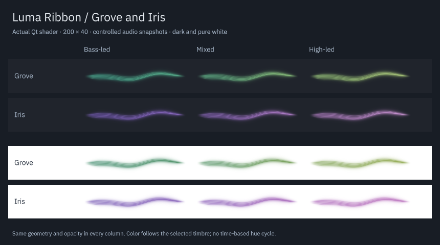

# Grove and Iris

Two additional palettes join Aurora, Ember and Ice. Grove moves from jade to leaf green, with a pale green highlight. Iris moves from violet to orchid, with a lavender highlight. Both retain the existing audio-driven timbre response, wider gradient, silence fade and reduced-motion behavior.

| Before | After | Why |
| --- | --- | --- |
| Three palette choices | Grove and Iris append choices 3 and 4 | Add a green and a violet identity while preserving saved selections |
| Names and color definitions repeated across views | Settings and preview tools use the palette catalog in `Palette.js` | Keep labels, order and colors consistent |
| Standalone preview showed three samples | A two-row grid shows all five at 200 × 40 | Preserve panel-size comparison |

| Palette | Background | First hue | Second hue | Highlight |
| --- | --- | --- | --- | --- |
| Grove | Dark | `#45b89a` | `#b3da72` | `#ecffd7` |
| Grove | Light | `#16724f` | `#718f24` | `#c5d994` |
| Iris | Dark | `#8060cc` | `#d58cdf` | `#f8e6ff` |
| Iris | Light | `#6140a8` | `#a84da9` | `#d2aae3` |

The light versions use deeper colors for visibility on white. Grove stays in the green family; Iris stays in the violet family. A stable tone holds its selected shade. High-frequency content adds the existing restrained highlight rather than cycling the hue with time.

The image is an actual Qt shader capture at 200 × 40, with controlled audio snapshots and the same geometry and opacity in each column. It is not a desktop recording. The updated standalone preview also renders all five palettes with generated PCM through FFTW.

The catalog preserves the exact existing colors and indices for Aurora, Ember and Ice. KConfig now accepts indices 0–4, and the configuration page lists all five names. The separate main-shape prototype supports `--palette 3` for Grove and `--palette 4` for Iris; use `--full` to see audio-reactive colors. The prototype remains excluded from installation.

## Verification

The normal project and optional main-shape prototype compile. The selected view and Plasma CTest suites pass 2/2, comprising 57 view entries and three Plasma entries. The existing color, perceptual, theme and settings cases now cover all five palettes. Their 42-entry selection also passes at 125% scaling and with the software backend. Existing visibility, lightness, chroma and continuity thresholds are retained.

The Plasma integration check verifies all five names in the configuration control and propagates every selection to both panel and popup. The six existing palette/theme color triplets and their indices were compared with the preceding source and remain identical. The generated-PCM standalone preview and both prototype palette choices were captured. The new palettes were inspected on dark and pure white backgrounds, with controlled bass, mixed and high-frequency states.

Rendering QML passes lint without warnings. Configuration lint retains its pre-existing warning that the base `Plasma::Applet` type does not declare the native `audio` extension; the same warning was reproduced against the preceding configuration source. The configuration loads and operates in the native Plasma test.

Evidence is in `build/evidence/grove-iris/`. The audio sources and production shader are unchanged; no backend recovery or sanitizer suite is rerun for this palette addition. This pass uses controlled snapshots and generated PCM, and does not claim a new playing-song assessment.

The package was installed under `/usr` and matches the source package and built native plugin. The fresh installed-app integration test passes all three entries, including the five palette selections. Desktop Plasma PID 264298 remains running; no session or audio service was restarted. A running panel can retain its earlier QML/configuration schema until a normal reload or login. A fresh `plasmawindowed org.kde.plasma.lumaribbon` process loads the new choices.
