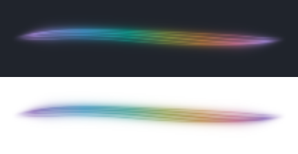

# Hue palette and hue shift

Date: 2026-09-06. Baseline: `b3f2904`.

Historical report. The subsequent [palette behavior correction](palette-behavior.md) limits Hue shift to the Hue palette. The global rotation and Ember comparison below describe the earlier implementation.

The **Hue palette** displays a complete spectrum along the ribbon: violet, blue, cyan, green, yellow, red and back to violet. All colors are present in one frame. Audio gently redistributes them without narrowing the palette or creating a time-driven cycle.



Native panel captures at 200 × 40, composited onto the corresponding background and shown at twice their size.

The separate **Hue shift** control rotates the selected palette from −180° to +180°, in steps of 1°. The default of 0° preserves its original colors exactly. The two endpoints represent the same half turn. Hue shift is a manual offset; adjusting it does not introduce an automatic color cycle.


Native 200 × 40 shader captures of the same held test snapshot, shown at twice their size. Only Hue shift changes between images. No test sound is played through the desktop output.

| Before | After | Why |
| --- | --- | --- |
| Every palette covered a limited color family. | Hue adds a full spectrum with soft transitions, local highlights and theme-aware lightness. | All colors can appear together while preserving the ribbon's shape. |
| A palette's color family was fixed. | A Hue shift slider sits beside the palette controls, with degrees and a visible 0° default. | Users can shift the whole palette while retaining its gradient and highlights. |
| Appearance sliders displayed percentages only. | The shared control supports degree values and 1° keyboard steps. | Hue has the expected units and remains usable from the keyboard. |
| Reset appearance restored the existing visual settings. | It also restores Hue shift to 0°. | Palette experiments remain reversible before Apply. |

Both settings affect the panel, popup and draft preview of one widget. Audio-reactive colors keep following the frequency balance within the rotated palette. For Hue, they redistribute its full spectrum; every hue remains visible. Disabling them holds the gradient still. Another widget can use a different hue shift with the same shared audio analysis.

## Color handling

`Palette.rotateHue` rotates the hue coordinate in OKLCH for the primary, secondary and highlight colors. It retains Oklab lightness and reduces chroma only where needed to fit sRGB. The existing 12-step gamut mapping is shared with ramp generation, so it has a fixed work limit. The conversion follows [Björn Ottosson's Oklab reference](https://bottosson.github.io/posts/oklab/), already used by this project.

Each view caches its rotated colors and 65-color ramp. Hue also uses six gamut-mapped anchors around the color wheel and a repeated endpoint, at Oklab lightness 0.73 on dark backgrounds and 0.52 on light backgrounds. The manual shift rotates their angles. Palette, theme or Hue edits rebuild them; incoming audio frames only sample the ramp. The shader receives six additional opaque color uniforms and interpolates adjacent stops. Audio warps the gradient coordinate by at most 8% of its length; its endpoints remain fixed. The Canvas uses 33 bounded gradient samples from the same anchors and distribution. Neither path does gamut conversion per pixel or per audio frame. Multicolor highlights brighten their local color rather than tinting the wheel with a single accent. Existing palette rendering, filament geometry, Bloom, audio capture and signal analysis are unchanged.

Uniform layout and color mapping were checked against the current [Qt ShaderEffect documentation](https://doc.qt.io/qt-6/qml-qtquick-shadereffect.html). The shader is built into a QSB package with Qt Shader Tools; no runtime shader generation or new texture is needed.

Finite out-of-range settings are clamped to the range. Non-finite values revert to 0°. The neutral case returns the original colors without a round trip through color conversion. The ±180° endpoints use the same angle internally for an exact match.

The configuration page requires native `appearanceRevision = 3`, including the new KConfig entry, palette index 6 and multicolor shader. Saved indices 0–5 retain their meanings. When Plasma still holds an older plugin, the page explains that the update becomes available at the next login and disables the appearance controls until then.

## Verification

The rotation tests cover the six original palettes and both theme variants at 5° intervals across the full rotation. They independently measure Oklab lightness and hue, check finite sRGB channels and retained chroma, and verify neutral restoration, equivalent endpoints, invalid input and ramp caching during audio updates.

Rendered rotation cases cover the six original palettes with both renderers and both theme variants, distributed across panel, vertical and popup sizes. They check immediate changes on a held frame, identical alpha, no additional audio samples, exact return to 0°, matching endpoints, continued audio-reactive colors and silence. Twelve additional multicolor cases cover both renderers, both themes, panel, vertical and popup sizes. They require all six HSV sectors in a single frame at low and high frequency balances, stable alpha, no autonomous color cycle, cached anchors, manual rotation, neutral restoration, equivalent endpoints, reduced motion and silence.

The native configuration test checks all seven palette entries and persistence of index 6, initial values, dragging, keyboard input, reset, negative-value persistence, panel/popup propagation and per-widget defaults.

The RelWithDebInfo build and all 10 CTest suites pass. This includes 101 view cases, 80 motion-view cases and 3 native Plasma cases. The native configuration page was inspected visually with Hue selected. The same three GUI suites pass at 125% scaling (101 / 80 / 3 cases) and with the software backend (96 / 80 / 3 passed, with 5 intentional shader-only skips in the view suite). There were no warnings in those CTest runs.

A fresh-process compatibility fixture against the previously installed native plugin confirms the update notice and disabled new controls. That fixture emits a Qt `QObject::disconnect: Unexpected nullptr parameter` warning during teardown; the normal native integration test is clean. `qmllint` reports only the existing static-type warnings for the custom native `audio`, `appearanceRevision` and `previewSize` properties.

Installed under `/usr` with `cmake --install`. All 63 manifest files match the source/build byte for byte. A fresh native Plasma test loads `/usr/lib/qt6/plugins/plasma/applets/org.kde.plasma.lumaribbon.so` and passes all 3 cases, including saving Hue and its offset. The running `plasmashell` retains the previous mapped library; the update becomes active at the next normal login. The desktop session, playback, routing and user settings were not changed.

Local logs and captures are under `build/evidence/hue-control/`. Repeat with:

```sh
cmake --build build -j 4
ctest --test-dir build --output-on-failure
QT_SCALE_FACTOR=1.25 ctest --test-dir build -R '^(view|motion-view|plasma)$' --output-on-failure
QT_QUICK_BACKEND=software ctest --test-dir build -R '^(view|motion-view|plasma)$' --output-on-failure
```

Long listening sessions and hardware output changes were not repeated for these color settings.
