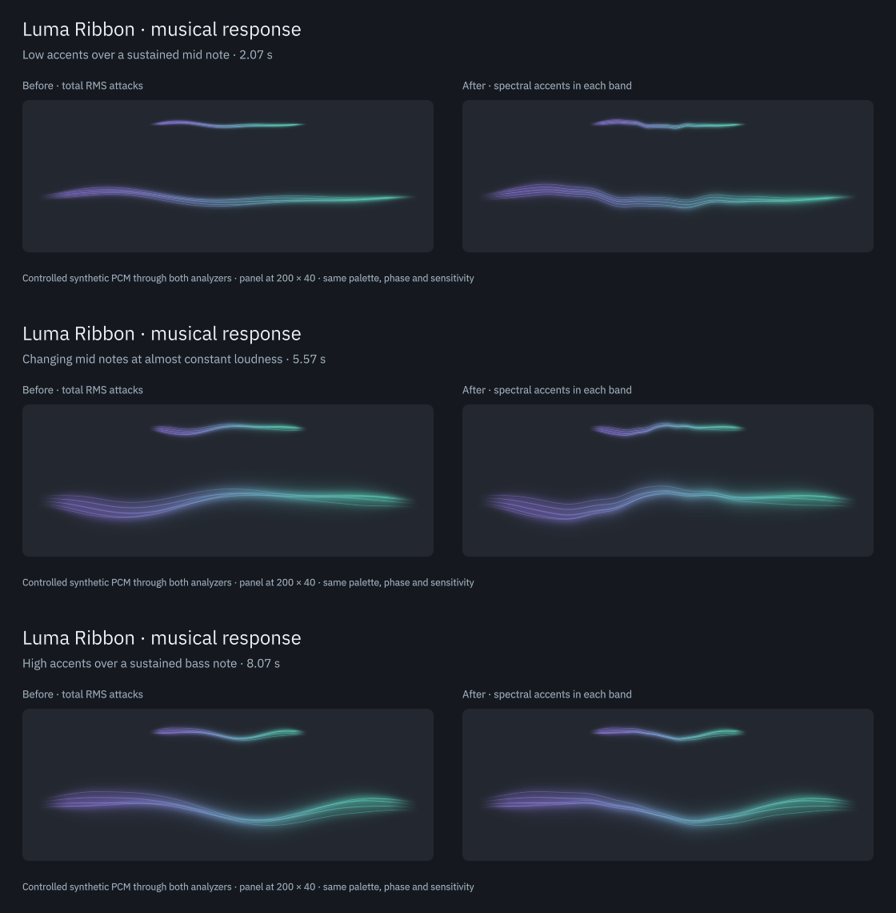
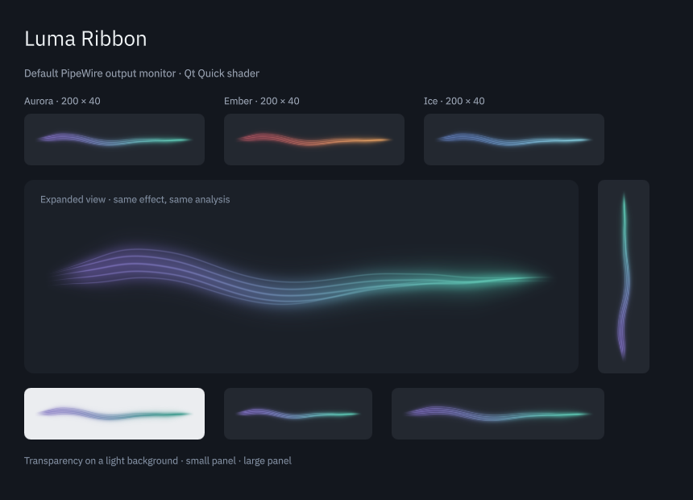

# Musical response refinement

Date: 2026-09-05. The goal is to make entries and accents within a song readable while keeping a continuous, restrained ribbon. The widget still analyzes the output mix. It does not identify or separate instruments.

This records the first spectral-accent pass. The subsequent [close-note and timing refinement](note-timing.md) updates filtering, envelope timing and FFT sizing; the measurements below describe the earlier pass.

## Changes and motion review

| Before | After | Why |
| --- | --- | --- |
| A quieter high note over a sustained bass barely changed the RMS attack detector | Spectral novelty is measured independently in three bands | An entry can be visible even when total energy barely changes |
| Sustained band levels carried nearly all visual response | Short bass, mid and treble envelopes complement the existing levels | Brief accents survive the longer smoothing used for a soft ribbon |
| A single travelling ripple represented every attack | Bass accents expand the bundle, mid accents bend it, and treble accents light parts of its cores | Each spectral region has a consistent visual role without bars or instrument labels |
| The worker inferred ripple starts from an envelope increase | The analyzer owns ripple age and trigger timing | A weaker new event need not exceed an earlier envelope |
| Only level rise restrained false attacks | Local spectral maxima, adaptive novelty thresholds and absolute floors reject steady texture | Small vibrato, sustained tones and stationary noise should not invent repeated beats |

Timing and cohesion: sustained levels keep their original smoothing and normalization. Accents have a 12 ms rise, a 65 ms decaying peak and an 85 ms release. The shared ripple has a 160 ms trigger interval; band envelopes can respond independently during that interval. The effect does not globally flash its opacity or change palettes on beats.

Performance: [SignalAnalyzer.cpp](../src/SignalAnalyzer.cpp) reuses the existing FFTs and adds about 4.2 KiB of fixed state. The realtime callback and bounded ring are unchanged. [ribbon.frag](../shaders/ribbon.frag) adds geometry modulation and core highlights in the existing fragment pass, without a new texture, blur pass or frame queue.

Accessibility: [RibbonView.qml](../package/contents/ui/RibbonView.qml) suppresses the additional accents in reduced motion. The gentle response to sustained audio remains. Shader and Canvas preserve complete silence transparency.

**Verdict: Approve for this refinement.** The checks below cover signal timing, bounded visual response, rendered frame sequences, reduced motion and both renderers. This is not an instrument-recognition or perceptual-accuracy score. A longer listening comparison across genres remains useful.

## Controlled comparison



These are actual Qt Quick frames. Both sides receive the same generated PCM, use the same phase, palette and sensitivity, and show a 200 × 40 panel ribbon above an expanded ribbon. The left uses the saved previous analyzer and shader; the right uses this implementation. The frames show a low accent, a mid-note change and a high accent. They are not Spotify stems.

The 14-second video `build/evidence/musical-response/musical-response.mp4` includes the generated audio. Its sections cover sustained tone, low accents over a mid note, changing mid notes at nearly constant loudness, high accents over bass, and silence. The temporary C++ renderer, QML, PCM, frame sequence and trace remain under `build/evidence/musical-response/motion/`. This tool never routes its generated samples into the user's audio output. Frames were inspected; no automatic listening score was assigned.

## Signal verification

The original reproducer failed:

```text
Masked high accent: peak=3.45299e-05
FAIL: a high accent over a sustained bass must trigger a visible response
```

The same stimulus now produces a normalized ripple envelope peak of `0.798736`. This is an internal response value, not an accuracy percentage. Run `./build/test-musical-response` to exercise the reproducer and additional fixtures.

| Check | Result |
| --- | --- |
| Quieter accent over a louder note in another band | Passed in all three bands at 8, 44.1, 48, 96 and 192 kHz, including anti-phase stereo |
| Band selectivity | Intended accent exceeds both other band accents by at least 3× in these fixtures |
| First visible accent threshold | About 20.1 ms at 44.1 kHz and 16 ms at 48 kHz, excluding capture, GUI, compositor and output-device latency |
| Constant-level note change | 740-to-1100 Hz change produces a mid accent of 0.835 with an RMS difference of about 0.000247 |
| Repetition | All 8 treble accents at 250 ms spacing remain visible after threshold adaptation |
| Closely spaced different bands | A high accent 60 ms after a low accent remains visible |
| Restraint | Sustained mixed tones, small 6 Hz vibrato, stationary seeded noise and a slow swell produce no repeated visible accents after settling |
| Silence and lifecycle | Sub-gate noise stays dark, missing input decays, capture discontinuities invent no attack, and resuming in silence retains no stale accent |
| Numeric safety | Features remain finite and within [0, 1], with ripple age within [0, 10] seconds |

Existing silence, sine-band, impulse, DC, nonfinite-input, queue and cadence tests still pass. This verifies specific behaviors rather than precision/recall on labeled music. The fixed FFT window still limits temporal resolution, especially at low sample rates. The detector is a small spectral-flux implementation informed by the papers in [references](references.md), not the full SuperFlux algorithm.

## Rendering and integration

- Full CTest suite: 5/5 passed.
- View suite: 24 checks passed at normal scale and 125%; software rendering passed 23 with the existing shader-only ripple check skipped.
- Six new cases isolate each band accent in shader and Canvas at 200 × 40. Each changes visible pixels, stays below a 30% increase in aggregate light, disappears in reduced motion and cannot illuminate silence. The tested shader treble accent changes aggregate light by about 1%, concentrated in the cores.
- Phase wrap also passed with active accents, including 125% and software rendering.
- ASan, UBSan and LeakSanitizer passed signal analysis, musical response and engine recovery. The latest musical fixtures were rerun in the instrumented build.
- The private PipeWire integration suite passed all eight routing, metadata, silence, no-microphone-fallback, restart and cleanup checkpoints. Desktop services were not restarted.
- QML lint and shader compilation passed. Native applet loading, shared popup state, configuration and removal passed in the separate Plasma test process, including the new snapshot fields.
- System installation was verified against the built plugin, QML and documentation. The Plasma integration test also passed using the installed `/usr` package and plugin. The only warning was the desktop's unavailable AT-SPI registry. A final live probe confirmed finite features, zero drops and release of its shared engine; one monitor node remained for the user's existing widget.

## Real audio and limits



Both analyzers processed the same 30 seconds of live Spotify monitor samples from the default AirPods output, stereo 48 kHz. The diagnostic saved feature values only, not the user's audio. It observed zero capture errors and zero dropped blocks. After the first two seconds, average bass/mid/treble accent values were about 0.189/0.059/0.031. They did not collapse to a shared permanently high value. These averages describe this excerpt only.

The old and new global onset averages were 0.179 and 0.284. A larger average is not itself better detection. The controlled masked-note and constant-level fixtures establish the specific improvement; the real capture checks behavior with a playing mix. The local maximum filter can suppress small pitch changes as well as vibrato. Longer listening, Bluetooth audiovisual latency and performance across genres remain unmeasured.

Evidence is under `build/evidence/musical-response/`. The existing panel may retain an older native plugin and compiled QML until the next normal login. Inspect the installed update in a fresh process to avoid restarting the user's session.
