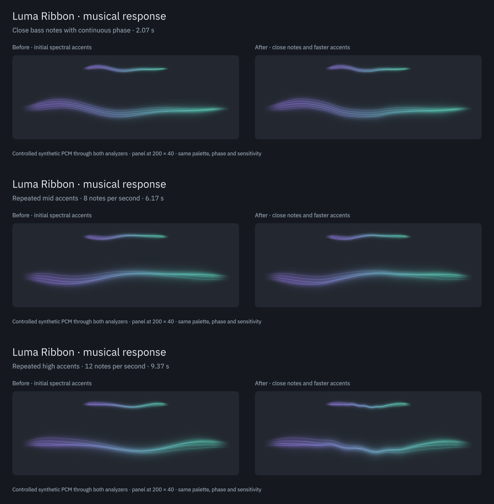
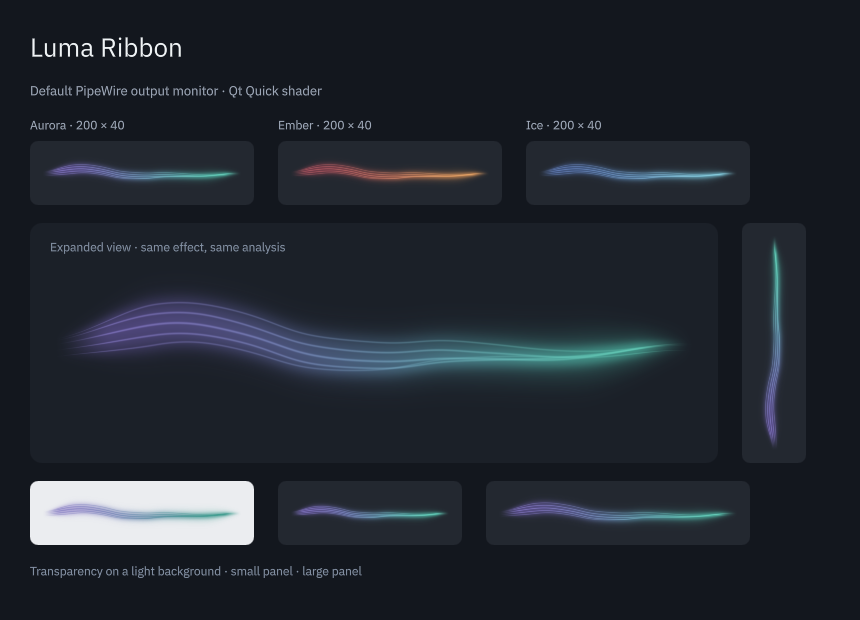

# Close notes and fast accents

Date: 2026-09-05. This continues the [musical response refinement](musical-response.md). The goal is to preserve close bass-note entries and the contrast between fast accents, without adding a new effect or making sustained sounds flicker.

## Findings and changes

| Before | After | Why |
| --- | --- | --- |
| A full neighboring FFT bin could hide a bass semitone | Neighbor influence is reduced at low pitches | A small musical interval should not disappear into a filter intended to restrain vibrato |
| The 80 ms rise / 1 s release novelty follower held the threshold high through dense sequences | A symmetric 250 ms exponential mean tracks recent novelty | The threshold can fall between notes instead of rejecting much of a repeated phrase |
| All accent peaks decayed over 65 ms, with an 85 ms visible release | Mid peaks/releases use 45/65 ms and treble 35/50 ms; bass remains 65/85 ms | Faster accents regain a visible rise between notes while bass movement stays soft |
| A fixed 2048-frame FFT lost time and frequency resolution at high sample rates | The window grows to 4096 and 8192 frames at high rates, retaining a quarter-window hop | 48/96/192 kHz now have the same approximate 42.7 ms window and 10.7 ms hop |

The baseline reproducer used phase-continuous semitone changes at constant amplitude, avoiding artificial clicks. The fast-accent test measures a new rise above the preceding trough, so an envelope stuck high cannot pass just because it is nonzero.

The implementation changes stay inside `SignalAnalyzer`. The `feed(samples, rate)` interface, audio capture, ring, QML fields, shader and settings remain unchanged. A new FFT plan is prepared only when the format needs a different size; failure retains the previous plan. The recovery test injects this failure and verifies a later retry.

The filtering approach is informed by the maximum-filter and adaptive-threshold discussion in [Böck and Widmer, DAFx 2013](https://www.dafx.de/paper-archive/2013/papers/09.dafx2013_submission_12.pdf). Their filter uses a musical frequency scale. Luma keeps its existing linear FFT and softens neighbor influence at low pitches; it is not a full SuperFlux implementation or a pitch tracker.

## Matched verification

Both versions were compiled against the same final fixtures. Detailed logs, saved baseline sources and binaries are under `build/evidence/note-timing/`.

| Fixture | Before | After |
| --- | --- | --- |
| Phase-continuous semitone entries at 82.4, 110, 220, 440 and 740 Hz, at 44.1/48/96/192 kHz | 7/20 exceed the response threshold without a sustained false accent | 20/20 |
| Repeated 740 and 4800 Hz accents at 8 and 12 notes/s, at the same four rates | 103/304 have a distinct rise | 304/304 |
| Eight ascending/descending bass-note entries in a phrase | New regression fixture | 8/8 at each of the four rates |
| Small 6 Hz vibrato at four pitches and four rates | Guard against overcorrection | All 16 cases stay below the visible-accent threshold after settling |

A semitone fixture passes if its intended band accent exceeds 0.12 while the sustained baseline remains below 0.08. A fast accent requires a peak above 0.12 and a rise of more than 0.08 above the preceding trough. The first accent in each sequence is excluded from the repeated-rise count. These are internal envelope criteria, not instrument recognition scores or proof that every note is individually perceived at 30 FPS.

Existing masked-note, independent-band, noise, slow-swell, impulse, DC, nonfinite-input, anti-phase, silence, queue and cadence regressions also pass. A larger vibrato or an abrupt timbral change can still resemble a new note. No accuracy score on a labeled real-music corpus is claimed.

## Motion review

The 14-second video `build/evidence/note-timing/note-timing.mp4` includes locally generated synthetic audio. Both views receive identical samples and share phase, palette, sensitivity and the same shader. The left uses the preceding analyzer; the right uses the update. Each side shows 200 × 40 panel rendering and an expanded ribbon. The sections cover a close bass phrase, 8 Hz mid accents, 12 Hz treble accents, and silence. The renderer and frame sequence are retained in `build/evidence/note-timing/motion/`. Generated audio was saved to the video, never played into the user's output during the test.

The shader's limited displacement and local core highlights preserve the ribbon's shape. No brighter global pulse or extra filament was added. The shared travelling ripple remains capped by its 160 ms interval; faster band accents have their own envelopes. Frame review shows restrained differences, best assessed in motion. Reduced motion suppresses the short accents as before.

**Verdict: Approve for the tested refinement.** The response now follows the controlled phrases more consistently. The shader's visual limits and reduced-motion behavior remain intact. Bluetooth audiovisual alignment and listening judgments across genres remain unmeasured.

## Build, resources and real audio

- Full CTest suite passed 5/5, including native Plasma loading, popup, settings and removal.
- The plugin and documentation were installed under `/usr` and compared with the build outputs. The Plasma integration test also passed against the installed package in a fresh process. Its only warning concerned the desktop's unavailable AT-SPI registry. After the final audio probe exited, one monitor node remained for the existing widget and Spotify was still playing.
- View tests passed 24 checks at normal scale and 125%; software rendering passed 23 with the existing shader-only ripple check skipped.
- ASan, UBSan and LeakSanitizer passed analysis, musical-response and engine-recovery tests. The instrumented private PipeWire integration suite passed all eight routing, restart, silence, no-microphone-fallback and cleanup checkpoints.
- The analyzer object grows from 49,304 to 196,768 bytes on this build, about 144 KiB more per shared engine. FFTW plan storage is additional and bounded by the selected window. Per-instance QML state does not duplicate the shared analyzer.
- An isolated warm-plan benchmark analyzing 30 seconds of PCM took about 44 ms at 48 kHz, 84 ms at 96 kHz and 175 ms at 192 kHz, versus 37/69/131 ms before. These are local analyzer timings, excluding capture, UI and GPU work, not a whole-widget CPU measurement.
- Both analyzers processed the same 30 seconds of Spotify output on the current default HDMI sink at stereo 48 kHz, with zero errors and dropped blocks. Only feature values were saved. The diagnostic did not record the user's audio or alter playback, volume or routing.

The screenshot is a separate fresh Qt Quick process receiving real monitor audio. An already-running panel may retain an earlier native plugin and compiled QML until the next normal login. No desktop session or desktop audio service was restarted. Whole-system suspend, physical hot-unplug, a labeled music benchmark and measured Bluetooth synchronization remain outside the completed checks.
