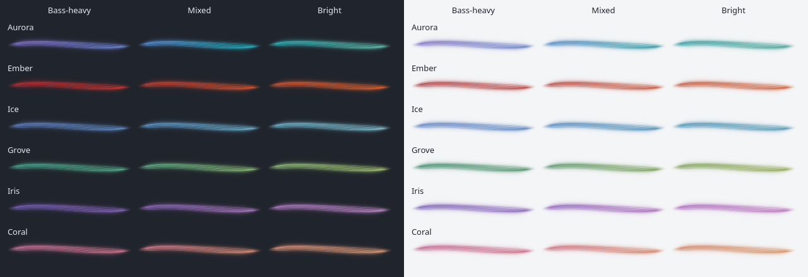

# Palette behavior and Hue shift scope

Date: 2026-09-06. Baseline: `685a165`.

The later [Ember and Iris refinement](ember-iris-refinement.md) and [Grove refinement](grove-refinement.md) implement the recommendations below. This report retains the earlier comparison.

Hue shift now belongs only to the Hue palette. Its slider appears when Hue is selected, and rotates that palette's complete spectrum. Switching to Aurora, Ember, Ice, Grove, Iris or Coral ignores the saved offset. Switching back to Hue restores it. The six presets keep their curated colors in both fixed and audio-reactive modes.

| Before | After | Why |
| --- | --- | --- |
| Hue shift recolored every preset. | Only the Hue spectrum receives the offset. | A preset keeps its identity after trying Hue. |
| The slider appeared for all palettes. | It appears only for Hue. | The page shows a control where it has an effect. |
| The preset colors passed through manual hue rotation. | They use the original palette colors directly. | The restriction applies to the panel, popup, preview and both renderers. |

No settings migration is needed. The stored `hue` value remains available for Hue, and existing palette indices retain their meanings. The change removes the unused general-purpose rotation function. Capture, analysis, shader code and the audio-reactive color mapping are unchanged.

## Dynamic palette review

These are native Qt shader captures at 200 × 40. All ribbons have identical geometry, energy and intensity; only palette, theme and the slow color descriptors vary. The three columns use spectral balances 0.35, 0.62 and 0.85, and treble shares 0.05, 0.2 and 0.65. Hue shift is zero. These are controlled snapshots, not a recording of a playing song.

The six presets have continuous interpolation and stable, gated color response. Their shared color filters use 350 ms for frequency balance and 550 ms for treble share. Silence holds the current hue while opacity fades. Those timings describe filter constants, not fixed transition durations.

The following are visual recommendations, not additional changes in this patch:

| Before | After, proposed | Why |
| --- | --- | --- |
| Aurora moves from violet through blue to mint. | Keep its current response. | The range is distinct and remains coherent in the comparison. |
| Ember's whole body becomes orange in bright passages. | Keep more red in the body and favor orange in its brighter details. | Preserve the requested fire-red identity. |
| Ice moves subtly from blue to cyan. | Keep its restrained range. | Its small variation suits the palette and remains visible on light backgrounds. |
| Grove approaches yellow-green in bright passages. | Consider a small reduction of the lime extreme. | Keep a stronger green identity, without removing the leaf-like variation. |
| Iris becomes pale magenta in bright passages. | Retain more violet in the body and reduce pale highlighting. | Make it read more consistently as violet. |
| Coral moves from pink to peach. | Keep its current response. | The change matches its intended pink-to-orange range. |

The [Ember and Iris refinement](ember-iris-refinement.md) and [Grove refinement](grove-refinement.md) implement these tuning opportunities. The comparisons do not establish which instruments a song contains; color follows the frequency balance of the whole mix.

## Verification

Before the scope correction, the focused palette checks passed 26 entries across all six presets, both themes and both renderers. The analyzer test also passed its 15 sample-rate/band combinations and checks for smoothing, silence, noise gating and volume invariance.

A new preset-isolation regression failed against the previous implementation: Ember received a −180° offset. The updated test requires exact pixel identity for each original preset at several saved offsets, in fixed and dynamic modes, with both renderers and themes. It also checks round trips through Hue, retained preferences and continued audio-driven color changes. Separate Hue tests cover the full rotation, finite values, gamut limits, equivalent endpoints, neutral restoration and cached conversion.

The native Plasma test checks slider visibility across every palette, draft preview behavior, persistence, and panel/popup isolation. Build logs and captures are under `build/evidence/hue-only-shift/` and `build/evidence/palette-review/`.

The RelWithDebInfo build passes. The complete `view` and `plasma` suites pass with 91 and 3 entries respectively. The focused multicolor, shift and preset-isolation checks pass all 28 entries at 125% scaling and all 28 with the software backend. These runs and the normal CTest run have no warnings. A fresh native Plasma process loads the installed library from `/usr/lib/qt6/plugins/plasma/applets/org.kde.plasma.lumaribbon.so` and passes all 3 integration entries.

All 65 installation-manifest files match the source/build. QML lint reports only the existing static-type warnings for the custom native properties `audio`, `appearanceRevision` and `previewSize`. No desktop or audio service was restarted, and the user's saved settings were not changed. The active panel can retain its earlier QML until the next normal login.

Long listening sessions and changes to physical audio hardware were not repeated for this scope correction.
