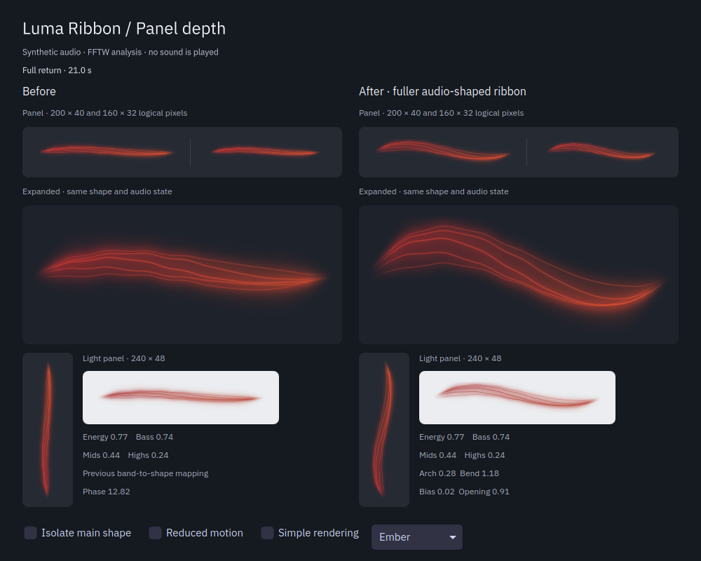

# More depth at panel size

Date: 2026-09-06. Baseline: `c129b42`.

The ribbon could collapse into a thin, nearly straight bundle during music with several active frequency bands. A settled three-tone mix reproduced a centerline excursion of only 1.66 logical pixels in a 200 × 40 view. The corrected version reaches 13.49 pixels on the same input, with room for the filaments and glow.



Each column uses its own version of the motion controller and renderer. Both receive the same PCM analysis, phase, attacks and colors. The capture shows the full-return section of the generated sequence, with small, expanded, vertical and light-background views.

| Before | After | Why |
| --- | --- | --- |
| Low and high bands could cancel the main arch without creating another readable bend. | Simultaneously active bands strengthen the counter-bend. | Balanced music keeps a broad silhouette instead of collapsing toward a line. |
| Filaments clustered closely together. | Greater opening, a slightly thicker base and more staggered folds. | The panel shows a continuous ribbon with visible space between strands. |
| Asymmetric folds displaced the whole bundle and could oppose the audio-driven curve. | The weighted bundle is centered on that curve. | Filament detail preserves the intended broad shape and follows the Canvas centerline more closely. |
| At sensitivity and intensity 1.5, faint halo tails reached the panel boundary. | The halo fades across the outer 6.5% of the short dimension. | The panel edge does not cut off the glow abruptly. |

## Motion and rendering

The worker still owns all spring state. A bounded term, `3 * (low * mid + mid * high + high * low)`, measures how strongly several normalized bands are active together. It is zero for a single band and peaks at an equal three-way balance. This term opens the counter-bend and the filament bundle. The existing energy gate, phrase response, damping and shared snapshot path remain in use.

The renderer centers the five weighted strands around the broad curve before drawing their cores, halos and veil. The same shader handles panel, popup and vertical layout. The simple Canvas renderer receives the updated shared curve. Reduced motion retains its fixed shape and phase; high-dominant passages keep a finer, shallower ribbon. No new settings or runtime dependencies were added.

## Verification

- Fresh build and all 10 CTest suites passed. Existing visual thresholds were retained.
- The new rendered regression crosses real PCM, FFTW analysis, the production motion controller and both renderers. It covers two mixtures, four panel sizes/orientations, and gains 1.0 and 1.5. The original 16 cases failed against the baseline; the final 32 cases pass.
- `motion-view` now passes 50 QtTest entries. Its existing checks cover shared panel/popup state, hidden views, reduced motion, silence and independent band accents. Both rendering suites also pass at 125% scaling.
- Software rendering passes 60 view entries with five intentional shader-only skips, plus all 50 motion-view entries.
- Motion and audio-state pass with AddressSanitizer, UndefinedBehaviorSanitizer and leak detection enabled.
- Rendering QML lint and diff whitespace checks pass. Capture, signal analysis, audio-state mapping, palette values and QML view code are unchanged.
- A matched 26-second native recording covers low, mid and high phrases, changing mixtures, quiet audio, a full return and silence. All 780 trace rows are finite. The broad centerline stays between 0.251 and 0.752 of the view height, with a maximum adjacent movement of 1.109 logical pixels at a 40-pixel height and 30 sampled frames per second. These measurements exclude individual accents, ripples and filament offsets; they do not measure GPU pacing or listening latency.
- A six-second passive monitor probe received real audio from the AirPods output at stereo 48 kHz, with zero errors, dropped or expired blocks and successful engine cleanup. Native live, reduced-motion and fallback captures were also inspected. This is not a controlled instrument-separation or Bluetooth latency measurement.

Local evidence is under `build/evidence/panel-depth/`, including the comparison tool, preserved baseline, trace, captures, `comparison.mp4` and test logs. Generated signals are used only by the verification tools and are never played through the desktop audio output. Long listening sessions and physical device changes were not repeated for this geometry change.

To repeat the checks:

```sh
cmake --build build -j 4
ctest --test-dir build --output-on-failure
QT_SCALE_FACTOR=1.25 ctest --test-dir build -R '^(view|motion-view)$' --output-on-failure
QT_QUICK_BACKEND=software ctest --test-dir build -R '^(view|motion-view)$' --output-on-failure
./build/luma-preview --synthetic
```
