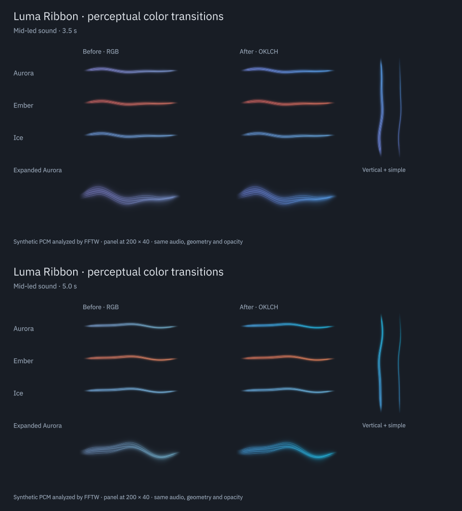

# Perceptual color transitions

Date: 2026-09-05. This pass refines the audio-reactive palette introduced in [dynamic colors](dynamic-color.md). Audio capture, analysis, smoothing and the shader are unchanged.

The subsequent [color depth refinement](color-depth.md) widens the gradient during mixed passages while preserving this cached OKLCH ramp.

| Before | After | Why |
| --- | --- | --- |
| RGB interpolation reduced Aurora's color strength between violet and green | Shortest-path OKLCH interpolation retains more chroma through blue and cyan | Intermediate colors remain distinct at panel size |
| Perceived lightness deviated from the interpolation between the palette endpoints | Lightness is interpolated directly in Oklab | Hue changes no longer introduce the same unintended lightness variation |
| Some desired intermediate colors fall outside sRGB | Reduce chroma at fixed lightness and hue, with 12 bounded search steps | Avoid changing hue by clipping individual RGB channels |

Performance: a view prepares a 65-color ramp when its palette or nominal background changes. Audio updates interpolate between adjacent entries. The table stays fixed during audio updates, verified by a signal spy. No conversion, trigonometry or gamut search runs for each frame. There is no shared mutable cache, new audio work, shader pass or render timer.

Timing and accessibility: the existing 350/550 ms timbre smoothing remains in the shared analyzer. Reversals follow its current state without an extra transition or delay. Reduced motion keeps the same slow color response. Turning off **Audio-reactive colors** restores the original fixed RGB gradient exactly.

Verdict: Approve for the tested palettes and renderers. Aurora shows the clearest improvement; Ember and Ice change less because their endpoints are closer in hue. The ribbon keeps its existing opacity and geometry.

Implementation: [Palette.js](../package/contents/ui/Palette.js), [RibbonView.qml](../package/contents/ui/RibbonView.qml#L43), and [perceptual and rendered regression tests](../tests/test_view.cpp).

## Rendered comparison

The two columns receive the same analyzed PCM, phase, intensity and sensitivity. The Qt Quick capture includes all palettes at 200 × 40, an enlarged Aurora view, vertical orientation and simple rendering. These are rendered frames, not generated artwork. The 14-second video is `build/evidence/perceptual-color/perceptual-color.mp4`; its soundtrack is generated test PCM and was not played into the user's output.

## Color measurements

The following numbers describe the palette curve before shader highlights and alpha blending. They compare the smallest retained chroma against the linearly interpolated endpoint chroma over 1001 positions. They are Oklab model measurements, not percentages of human-perceived improvement.

| Palette and background | RGB minimum retained chroma | OKLCH minimum retained chroma |
| --- | --- | --- |
| Aurora, dark | 58.7% | 100.0% |
| Aurora, light | 66.1% | 86.1% |
| Ember, dark | 93.2% | 100.0% |
| Ember, light | 95.2% | 100.0% |
| Ice, dark | 89.9% | 100.0% |
| Ice, light | 96.6% | 100.0% |

Aurora on a light background needs some chroma reduction to fit sRGB. The largest lightness deviation from the intended interpolation falls from 0.0164 to below 0.00005 on the unquantized sampled curve. Qt's rendered-color property tests allow 0.002 for conversion and lookup precision. They also bound adjacent perceptual steps and verify exact fixed-mode endpoints.

A local Qt benchmark performed three passes of 30,000 GUI snapshot/color updates for each version. Both took roughly 26–29 microseconds per update. This measurement excludes PipeWire, painting, GPU work and palette-table construction, and does not establish a whole-widget CPU saving. The numerical conversions are confined to palette changes.

## Verification and scope

Evidence is in `build/evidence/perceptual-color/`, including the saved preceding QML, failing baseline tests, color metrics, captures and benchmark source. The regular test suite covers all six palette/theme combinations, actual pixels from shader and Canvas, 30/60 FPS cadence, hidden views, reduced motion, fixed mode, silence, phase wrapping and native Plasma configuration/lifecycle. Final run and installation results are in [verification](verification.md).

The full suite passed 6/6. View tests passed 36 at normal scale and 125%, and 35 plus one intentional shader-only skip in software. The source package and installed files under `/usr` match, and the native Plasma integration test passed against the installed copy. A live-output preview was captured and inspected. The current desktop process can retain the preceding QML until it reloads; this work did not restart it.

The change is limited to palette interpolation and its tests/documentation. End-to-end audible synchronization, Bluetooth latency, physical suspend/resume and an extended whole-widget resource test remain separate, uncompleted checks. This pass does not claim those results. No desktop or audio service restart is required by the implementation, and none was performed during verification.

The math uses Bjorn Ottosson's public-domain [Oklab reference](https://bottosson.github.io/posts/oklab/), with its 2021-01-25 matrices. The choice of interpolation space follows the [W3C color interpolation discussion](https://www.w3.org/TR/css-color-4/#interpolation-space). The gamut search preserves lightness and hue by reducing chroma; it is deliberately smaller than the complete CSS gamut-mapping algorithm.
