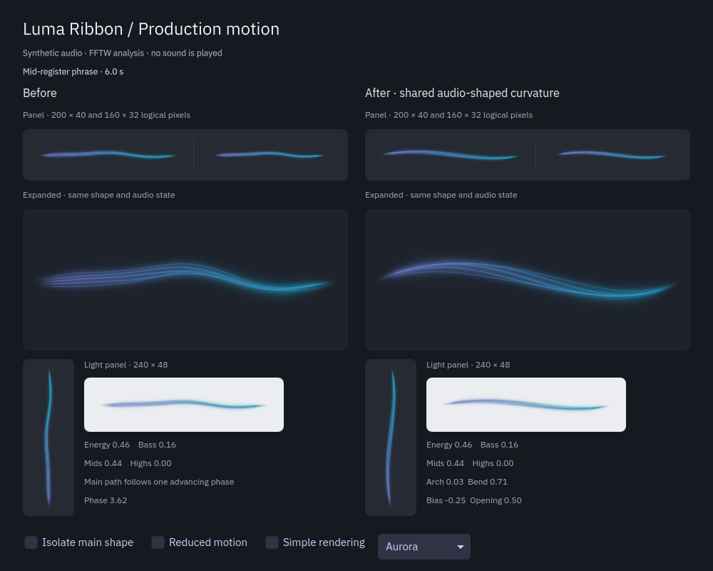

# Shared audio-shaped motion

The main ribbon now changes its broad silhouette with the music. This integrates the earlier design study into the production worker, shader and Canvas fallback. Palette values and color interpolation are unchanged.



Both columns use the same generated PCM, FFTW analysis, colors and attacks. The right column loads the real production `RibbonView.qml` and compiled shader. The left column preserves the previous view and shader. This image is a native Qt capture, not a mockup.

| Before | After | Why |
| --- | --- | --- |
| Two advancing sine waves set the main path. Audio mainly changed their amplitude and speed. | Relative band levels and phrase changes steer an arch, counter-bend and horizontal bias. | Different passages can produce different silhouettes at the same phase. |
| The improved shape existed only in a separate prototype. | One worker-owned motion state reaches every panel and popup through the latest audio snapshot. | A newly opened view joins the current motion without starting another animation. |
| Filament opening followed a periodic fold. | Filament opening follows the shared shape and current bend. | Keep the strands together around the main curve. |
| Replacing the broad curve risked losing fast mid response. | An independent short counter-bend retains the existing mid-accent envelope in both renderers. | Fast notes remain visible while the slower shape settles. |

The visual difference is clearest across changes of timbre. Bass-led input forms a broad arch, mid activity strengthens the counter-bend, and high-led input produces a shallow opposite arch. Stable tones settle into a stable shape. A small audio-scaled procedural displacement preserves continuity, bounded below one logical pixel at a 40 px panel height. This does not identify instruments, extract melody or estimate tempo.

## Implementation

`RibbonMotion::advance(features, seconds)` contains the motion state behind one Qt-independent interface. Four critically damped states retain position and velocity when their targets change. Energy and mid envelopes are compared with slower memories to add phrase response. The module has fixed storage and no allocations, events or render-frame queue. Each worker step is bounded to 100 ms after a stall.

`AudioEngine` advances the module outside the realtime callback and publishes `RibbonShape` beside the analysis result. `AudioState::sample()` copies the four fields without applying instance sensitivity to the shared trajectory. Sensitivity still controls the displayed audio levels. Hidden views keep their existing update suppression; reopening reads the current snapshot.

Below energy 0.002, the module holds the last shape and clears velocity. The existing energy envelope fades it out. Resuming audio moves from that position. Reduced motion holds the shape controls and procedural phase fixed and suppresses short accents; sustained light and thickness still respond. The fallback uses the same broad curve, with its simpler glow and no travelling ripple.

The new `vector4d` uniform uses Qt's documented mapping to GLSL `vec4`, in the existing `std140` block. Shaders remain build-time `.qsb` resources. See the official [ShaderEffect documentation](https://doc.qt.io/qt-6/qml-qtquick-shadereffect.html) and [shader build integration](https://doc.qt.io/qt-6/qtshadertools-build.html), checked against Qt 6.11.2.

## Verification

- The normal build succeeds and all nine CTest suites pass, including analysis, musical/color response, engine recovery, audio-state ownership, both rendering suites and Plasma integration.
- `motion` checks analyzed 100/1000/6000 Hz stereo tones, distinct settled shapes, abrupt band changes, missing-input decay, the silence gate, resume continuity and bounded elapsed time. The largest shape-field change in the tested 10 ms sequence is 0.0337. This is a normalized state measurement, not pixel displacement or an input-to-screen latency claim.
- `audio-state` checks a late subscriber at a different sensitivity, one shared capture, coalesced wake-ups and final-owner teardown. The mature shape is shared instead of restarting at zero.
- The 18-entry `motion-view` suite checks visible deformation at fixed phase, immediate popup state, hidden-view inactivity, reduced-motion invariance and independent accents. Mid accents are checked in both renderers at 160 × 32, 200 × 40, 240 × 48, 432 × 180 and 40 × 200 vertical sizes. The existing 65-entry rendering suite also passes without relaxing its thresholds.
- Both rendering suites pass again at 125% scaling. Native before/after captures were inspected for bass, mids, highs, changing mix, reduced motion, automatic software fallback and fractional scaling. The six-palette production preview was recaptured with unchanged palette data.
- With the software backend, `view` reports 60 passes and five intentional shader-only skips; `motion-view` passes all 18 entries. Automatic and forced fallback both use Canvas in this run.
- A complete 26-second sequence contains 780 rendered frames and finite snapshots. Ordered frames around a band change, the quiet passage and final fade were inspected. The broad centerline stays between 0.314 and 0.697 of the view height; its largest adjacent sampled movement is 0.804 logical pixels at 40 px height. This diagnostic excludes short ripples, independent accents and glow. It does not measure runtime frame pacing. `comparison.mp4` includes only the generated test signal as its soundtrack.
- Motion, audio-state and engine-recovery tests pass under AddressSanitizer and UndefinedBehaviorSanitizer, with leak detection enabled.
- A six-second passive live probe connected to `sink-sunshine-stereo`, stereo 48 kHz, with no errors, drops or expired blocks. It reported `shared-engine=yes released=yes`. It received silence, so this pass does not claim a listening assessment with a playing song.

The historical prototype keeps its own earlier shader as a fixed comparison baseline. It still builds separately and has no install rule. The installed applet uses the production worker implementation, not the prototype's GUI controller.

Evidence is under `build/evidence/shared-motion/`, including the original source archive, build/test logs, native comparison source and captures. Capture, analyzer, processor and palette hashes match their pre-change values. Long listening sessions, physical Bluetooth synchronization, GPU frame-pacing measurements and moving the user's actual panel between differently scaled screens remain unverified for this integration.

## Reproduce

```sh
cmake -S . -B build -DCMAKE_BUILD_TYPE=RelWithDebInfo -DCMAKE_INSTALL_PREFIX=/usr
cmake --build build -j 4
ctest --test-dir build --output-on-failure
QT_SCALE_FACTOR=1.25 ctest --test-dir build -R '^(view|motion-view)$' --output-on-failure
QT_QUICK_BACKEND=software ctest --test-dir build -R '^(view|motion-view)$' --output-on-failure
./build/luma-preview --synthetic
```

The normal [installation and removal instructions](../README.md) apply. There are no new dependencies or settings.

The updated package and native plugin are installed under `/usr` and match the source/build files. A fresh installed-app Plasma test passes all three entries, covering popup, settings and removal. The user's Plasma process remains PID 264298. Its process map still contains the earlier plugin image, so the current desktop needs its next normal login to load this native update. No desktop or audio service was restarted, and playback/routing were not changed.
