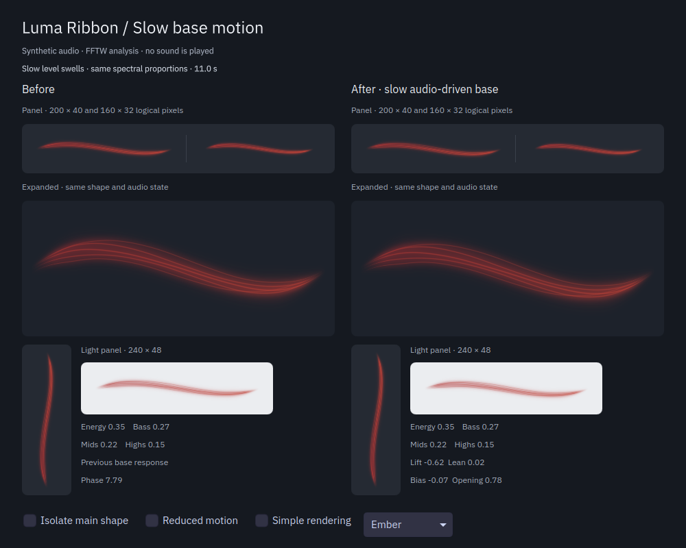

# Slow movement of the ribbon base

Date: 2026-09-06. Baseline: `df5b503`.

The broad ribbon could look stationary while its filaments moved, especially when a song kept similar proportions of bass, mids and highs. Its base now lifts with slow increases in loudness, lowers as a phrase falls away, and leans with changes in timbre. It follows the audio without adding a periodic animation.

Both columns receive identical synthetic PCM analysis. Each uses its own motion controller and shader. The view includes panel sizes, an enlarged ribbon, a vertical panel and a light background. No generated sound is played through the desktop output.

| Before | After | Why |
| --- | --- | --- |
| Similar band proportions could leave the base nearly stationary. | Slow loudness changes lift and lower the whole ribbon. | A musical swell remains visible even when its spectral balance changes little. |
| Broad shape and short filaments provided most of the visible movement. | A slower timbre response adds a small lean beneath those details. | Phrase movement remains distinct from attacks and vibration. |
| Display-normalized energy was the available level control. | The new movement uses RMS and timbre before display normalization. | Automatic gain adaptation cannot create a false crescendo on a sustained tone. |
| Panel and popup already shared their shape. | They also share lift and lean; reduced motion disables both. | Opening a popup starts at the current shape, with no local catch-up animation. |

## Implementation

`RibbonMotion` retains two additional positions, velocities and exponential references on the existing analysis worker. Loudness uses fixed logarithmic compression, with no adaptive gain or division by a quiet reference. Loudness and timbre trends are measured against 2.5-second memories. Bounded targets feed critically damped responses at 2.4 and 2.0 radians per second, reaching about 90% of a held target in 1.6 and 1.9 seconds. A sustained sound eventually settles as the references catch up.

The shader and Canvas apply the same displacement to the broad centerline. The veil and filaments move together, with anchored endpoints. The existing curvature control scales this movement; reduced motion removes it. A smooth headroom limit attenuates the addition when the original curve already occupies much of the panel height. No setting, timer, frame queue or runtime dependency was added. The PipeWire callback and signal analyzer are unchanged.

The new shader input follows Qt's documented property-to-uniform mapping and the existing `std140` block at binding 0. The shader is prepared by `qt_add_shaders`, as required for Qt 6. Checked against the official [ShaderEffect documentation for Qt 6.11.2](https://doc.qt.io/qt-6/qml-qtquick-shadereffect.html).

## Verification

The build succeeds with GCC 16.2.1, Qt 6.11.2, Plasma 6.7.4, KF 6.29.0, PipeWire 1.6.8 and FFTW 3.3.11 on CachyOS. The signal, musical-response, color-response, motion, both recovery suites, audio-state and general view suites pass. Motion-view and the native Plasma test were repeated after the rendering headroom correction.

- Motion tests cover sustained bass/mid/high tones, crescendos, falling phrases, independent timbre lean, normalization changes, silence, resumption, invalid input and worker scheduling variation. The baseline fails the new crescendo check as expected.
- Motion-view passes 90 QtTest entries at normal scale, at 125% scaling and with Qt's software backend. Existing appearance limits remain intact, including the 0.55 maximum rendered centerline excursion at combined control extremes. The native Plasma suite passes its three entries.
- Shared panel/popup state, hidden views, reopening and reduced motion are covered by native rendering tests. Audio-state tests also check late subscribers, different sensitivities, bounded wake-up events and final-owner removal.
- Motion and audio-state pass under AddressSanitizer, UndefinedBehaviorSanitizer and leak detection. Rendering QML lint and diff whitespace checks pass.
- All 69 installed files match the build or source tree. A fresh native Plasma test loads the plugin from `/usr/lib/qt6/plugins/plasma/applets/` and passes all three entries.

The new native render regression feeds a balanced three-tone mixture through FFTW and the production motion controller, with an eight-second amplitude envelope. It holds phase, brightness, colors, accents and the original shape coordinates fixed in the rendered comparison, isolating the added movement. The two sampled phrase extremes differ by about 3.8 logical pixels at 200 × 40. Both renderers retain the same image when lift and lean change under reduced motion; missing fields behave exactly like zero.

A 32-second native comparison contains 960 sampled frames with steady music, slow swells, bass/mid changes, quiet audio, a full return and silence. Every trace value is finite. At default curvature, the broad centerline stays between 0.240 and 0.763 of the height. At curvature 1.25 it stays between 0.207 and 0.812. The new base component contributes at most 2.42 logical pixels of displacement at height 40, or 2.78 at maximum curvature. Its largest adjacent step is 0.153 pixels at the default and 0.230 at maximum curvature. These are sampled geometry measurements, excluding fast accents, ripples and filament offsets. They do not measure GPU frame pacing or audio latency.

A 12-second passive desktop probe resolved the default AirPods output but received no audio buffers. It reported no capture errors, dropped blocks or expired blocks, and released the shared engine. The expected-audio check therefore failed. Real-song behavior was not verified in this run, and playback or routing was not changed.

Local evidence, including preserved baseline sources, the comparison tool, trace and recordings, is under `build/evidence/slow-base-motion/`.

## Limits

This response follows loudness and spectral changes, not instrument identities or a detected musical score. Heavily compressed passages with little change can still be fairly still. A constant tone deliberately settles. Physical output changes, long listening sessions, Bluetooth timing and mixed-monitor movement need separate desktop checks.

The running Plasma process can retain an older native library after installation. Missing fields remain compatible, but the new motion requires the updated library at the next normal Plasma login. No session or audio service is restarted by this change.
