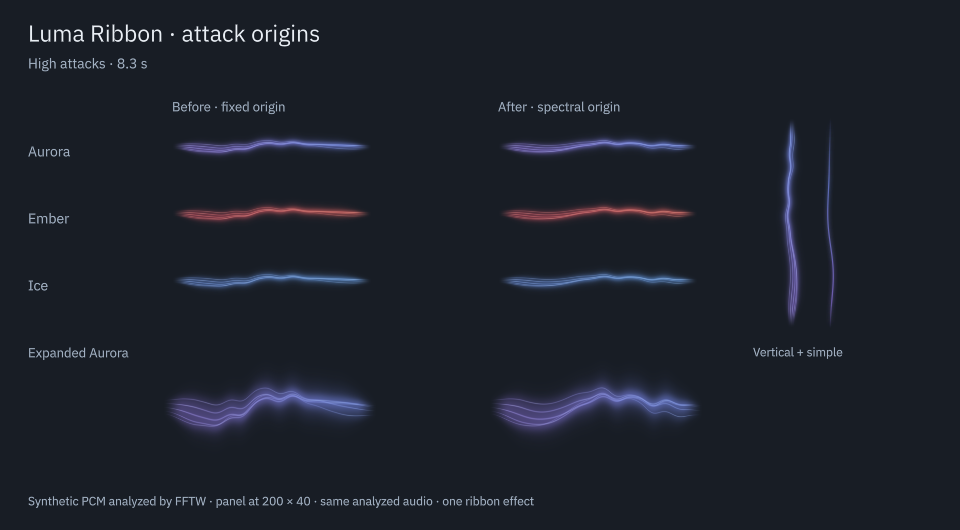

# Wake-up, audio freshness and attack origins

Date: 2026-09-05. This pass improves the first response after silence, discards expired audio after a worker stall, and places each attack ripple according to its spectral content. It also measures a frame scheduling alternative and retains the existing timer after that alternative performs worse on the tested desktop.

## Result

| Before | After | Reason |
| --- | --- | --- |
| A fully dark view discovers resumed audio through 120 ms polling | The shared engine wakes visible dark views when audible energy returns | Remove avoidable polling delay on the first note |
| Queue capacity limits memory, but a blocked consumer can read old audio | Blocks carry their monotonic receipt time; the consumer discards expired blocks | Do not replay old musical activity after a stall |
| Every ripple starts at 46% of the ribbon | Bass, mid and treble attacks favor 32%, 50% and 68%; simultaneous attacks interpolate between them | Give different spectral accents a consistent spatial response |
| Tests count updates at the selected FPS limit | A separate probe records update and Qt frame-swap intervals for both scheduling approaches | Judge regularity as well as average rate |

The visual change is restrained at 200 × 40 pixels and clearer in the enlarged view. It preserves the five filaments, palette, halo, intensity and audio-driven phase. No extra effect, configuration option or rendering pass is added. Reduced motion suppresses travelling ripples; the simple renderer keeps its existing band-accent response without travelling ripples.

The 14-second comparison is `build/evidence/timing-response/timing-response.mp4`. Both columns receive the same analyzed PCM. Only the ripple origin differs. It includes all palettes, panel-size views, an enlarged view, vertical orientation and simple rendering. Its soundtrack is synthesized test PCM, never played through the desktop output. This is a rendered Qt Quick comparison, not generated artwork.

## Audio and ownership

`AudioIngress` stores the callback's existing monotonic time in each completed block. This is receipt time, not a claim about when a sound reaches a speaker or Bluetooth headphones. `AudioProcessor::tick()` now uses that same clock domain. A block expires after `max(120 ms, 1.5 * (quantumFrames + 512) / sampleRate)`. The larger allowance keeps legitimate large-quantum, low-rate capture working. The consumer counts expiration separately from ring overflow, retains the 16-block work bound, and decays the previous envelope before processing fresh data after a long gap. No additional clock call, allocation, logging or Qt access is added to the realtime callback.

`AudioEngine` is a QObject owned by the acquiring GUI/event-loop thread. Snapshot access remains protected by its existing mutex. A transition above 0.002 normalized energy posts one coalesced GUI wake-up, rearmed below 0.0005. These thresholds allow a visible response even at the minimum sensitivity and avoid repeated notifications around silence. The worker publishes the snapshot before notifying. An atomic pending flag bounds the queue to one pending wake-up for the shared engine. The GUI event carries no audio frame; each view reads the latest snapshot. Deleting the final owner still stops and joins the worker; QObject destruction removes pending callbacks.

Only visible dark views handle the wake-up signal. Hidden views do not sample or paint. The existing idle poll remains for startup, very faint signals and compatibility with a native plugin already loaded before this update. Fully silent polls do not update shader properties or repaint. Normal playback continues to use the existing 30/60 FPS timer.

The analyzer weights eligible attack strengths by their squares and computes an origin between 0.32 and 0.68. It latches that value only when starting a new ripple. The current ripple cannot drift sideways as the spectral balance changes. This represents frequency-band activity, not instrument separation or stereo panning.

## Measurements

A GUI handoff probe makes an analyzed snapshot available at twelve different points in the idle polling interval. The preceding view took 5–106 ms, with a mean of 53.8 ms, to read it. The updated view took 0.05–0.14 ms in the same-thread notification test, with a mean of 0.09 ms. These numbers measure notification-to-QML state update only. They exclude acquisition, FFT windows, smoothing, worker-to-GUI dispatch and display presentation; they are not end-to-end audio latency figures. Production dispatch can still wait for a busy GUI thread.

A separate 4.5-second run for each scheduling mode measured Qt frame swaps after a 500 ms warm-up. The screen reported 180.063 Hz in this desktop session.

| Scheduling / limit | Mean interval | 95th percentile | Maximum |
| --- | --- | --- | --- |
| Existing timer, 30 FPS | 34.01 ms | 34.91 ms | 35.02 ms |
| FrameAnimation with deadline gate, 30 FPS | 33.38 ms | 47.65 ms | 48.39 ms |
| Existing timer, 60 FPS | 17.00 ms | 17.81 ms | 18.13 ms |
| FrameAnimation with deadline gate, 60 FPS | 16.68 ms | 17.14 ms | 32.20 ms |

Qt recommends considering [FrameAnimation](https://doc.qt.io/qt-6/qml-qtquick-frameanimation.html) for imperative animation. On this session, the tested gate alternated shorter frames with longer gaps, especially at 30 FPS. It was rejected. The existing timer's slightly conservative 17/34 ms intervals remain. These are Qt frame-swap observations in one desktop configuration, not physical presentation timestamps or a refresh-rate compatibility matrix. Source and logs for the experiment are in `build/evidence/timing-response/pacing/`.

Rendered tests locate the strongest displacement around 32.1%, 50.1% and 67.7% of the panel width for the three band origins. At a strong test attack, peak displacement is about 1.1 logical pixels at 200 × 40. Crease checks pass at all three origins and the legacy center. The positions remain bounded and fixed throughout each ripple in the musical regression suite.

## Verification

- CMake build and QML lint passed without project warnings. No new runtime dependency is required.
- Full CTest suite: 7/7 passed.
- Qt Quick view: 41 passed at normal scale and 125%; software rendering: 36 passed and five intentional shader-only skips.
- New audio-state test: one engine for two states, five blocked-GUI audio starts coalesced into one notification, delivery to both states, rearming, and final removal with a queued notification.
- New freshness tests: full stale queues at 8/48/192 kHz, silent recovery, fresh-audio recovery, expired-block accounting and decay of the pre-stall envelope. The existing 28 rate/quantum cases still pass.
- ASan, UBSan and leak checks: all five backend suites passed. The private PipeWire integration passed all eight routing, restart, silence and cleanup checkpoints on the freshly rebuilt instrumented binaries, with zero observed overflow or expiration.
- A 20-second capture of the real default AirPods output at stereo 48 kHz had finite normalized values, zero errors, zero overflow and zero expired blocks. A live Qt Quick preview was captured and inspected. Desktop playback and routing were not changed.

Evidence, probe sources and logs are in `build/evidence/timing-response/`. The successful final sanitizer records are `asan-final.log`, `private-pipewire-final.log` and `private-probe-final.log`. An initial sanitizer invocation encountered a missing newly added build target; it was discarded, CMake was explicitly reconfigured, and the complete build and checks were repeated.

Remaining checks include physical audible synchronization with Bluetooth, physical suspend/resume, hot-unplugging hardware, long-duration resource usage and other compositor/driver/refresh combinations. Receipt timestamps alone do not solve Bluetooth presentation latency. See the [PipeWire time model](https://docs.pipewire.org/structpw__time.html) for the distinction between graph, queue and device timing.

## Installation

Installed under `/usr` with `sudo cmake --install build`. The installed native plugin and QML package match the build/source files. A fresh process using the installed plugin passed the native Plasma applet test, including popup, configuration, two instances and removal.

The desktop's existing Plasma process, PID 264298 during this pass, retained its older mapped native library. It was not restarted. The installed C++ changes and shader resource will load in a fresh Plasma process, for example at the next normal login. The current QML remains compatible with the older native plugin. Spotify remained Playing and one desktop Luma monitor remained after the probes closed.
