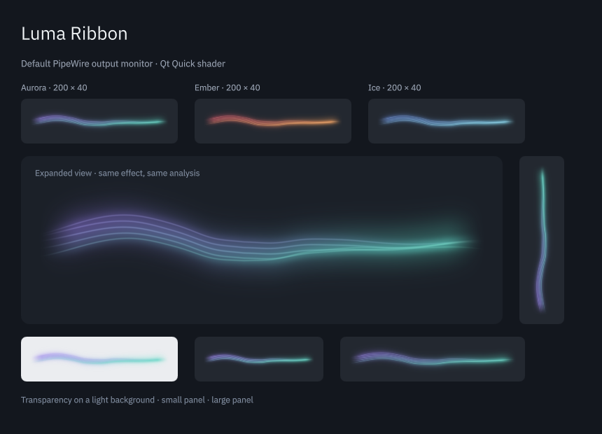

# Visual peer review

This document records the review before implementation of its recommendations. The subsequent [visual refinement](visual-refinement.md) includes matched captures, selected changes and new verification results.

2026-09-05. Independent reviews by **GLM-5.3-Flash** through OpenCode using `zai-coding-plan/glm-5.3-flash`, and **Gemini 3.8 Flash High** through `agy --model gemini-3.8-flash-high --effort high`. No OpenRouter provider was used.

Both reviewed the panel and popup screenshots, a fresh shader gallery captured with real PipeWire audio, and the updated fallback gallery. GLM received PNG attachments directly. Gemini used the supplied local image paths and reported inspecting all four images. Both also received numbered excerpts of the shader and QML, the intended visual behavior and size constraints. Neither received the earlier review's verdict or the other model's critique.

The task was review only. These are recommendations, not implemented changes. No shader, audio code, saved widget setting or desktop service was changed in this review. The fresh preview closed after its capture.

## Quality assessment

| Reviewer | Panel | Popup | First-version verdict |
| --- | --- | --- | --- |
| GLM-5.3-Flash | B−: appropriate identity, but details merge into a soft streak at panel size | A−: readable filaments and restrained bloom; the broad veil looks slightly smoky | Approve |
| Gemini 3.8 Flash High | B+: readable and restrained, with a somewhat blunt right end | B−: filaments spread too far apart and resemble separate wires | Approve |

These grades are subjective and use no shared numeric rubric. In particular, the reviewers disagree about whether the popup's visible filament spacing is a strength or a weakness. Their agreement is narrower: the continuous ribbon, restrained palettes and simple fallback are worth preserving, and contrast on light backgrounds needs attention.

My assessment is that the first version looks good, particularly as a quiet panel accent, but still has room for visual refinement. The larger view exposes the regular spacing of the strands. I would improve the cohesion of the light and the ends before changing the overall composition or adding detail.

## Proposals and assessment

| Before | Suggested after | Why |
| --- | --- | --- |
| On the gallery's light card, the pale core and halo lose definition. Both reviewers flagged this. `package/contents/ui/RibbonView.qml:24`, `shaders/ribbon.frag:60` | Test a more saturated core and a smaller veil contribution, keeping the silence gate intact | Better visibility on light panels. Avoid making the dark-panel appearance harsh or adding a permanent opacity floor |
| GLM sees a detached teal cloud above the strands in the large gallery sample. Veil and filament colors use different longitudinal mappings. `shaders/ribbon.frag:45`, `shaders/ribbon.frag:60` | First test aligning the veil's color progression with the filament bundle | Light may feel more connected to the ribbon. This would not by itself fix a spatial offset or excessive halo width |
| The right end can look rounded and heavier than the left. Gemini prioritizes a taper; GLM also notices the bright mass but wants to retain the existing taper. `shaders/ribbon.frag:25`, `shaders/ribbon.frag:52` | Test a modest taper of strand spread and halo width near the ends, not just alpha | A more natural finish. Too much taper would shorten the visible ribbon or concentrate strands into a bright point |
| GLM wants more panel definition; Gemini wants less separation in the popup. `shaders/ribbon.frag:52`, `shaders/ribbon.frag:56` | Compare a slightly stronger central filament and weaker outer filaments before changing global spacing | A clearer hierarchy may help both sizes. Do not require all five strands to remain individually visible at 160 × 32, since the intended shape is one continuous ribbon |

## Suggestions that should not be copied directly

- Gemini's proposed taper contains `smoothstep(1.0, 0.75, x)`. GLSL defines the result as undefined when the first edge is greater than or equal to the second. A descending envelope must use ordered edges and inversion. This is a defect in the proposed snippet, not in the current shader. See the [Khronos reference](https://registry.khronos.org/OpenGL-Refpages/gl4/html/smoothstep.xhtml).
- GLM's height-aware core recommendation partly overlaps the existing `pixel = 1.0 / resolution.y` and minimum core width. That resolution is in logical pixels; an assertion about one physical pixel requires a separate device-scale check. Any further adjustment needs a measured comparison at native size and fractional scale.
- An unconditional minimum alpha could violate the required fade to silence. Contrast changes must preserve the existing audio gate and full transparency during silence.
- Neither screenshot set proves transient clipping, temporal aliasing or bad frame pacing. The comments about treble bloom and micro-aliasing are hypotheses. The images show a bright cyan region, but they do not establish a blown-out transient.
- Increasing core opacity alone may still leave a pale tint weak against white. Contrast should be judged from the composited result, not a higher numeric opacity.

## Recommended order

1. **Core/veil balance on light and dark backgrounds.** Compare unchanged and candidate rendering using the same fixed audio features and phase at 160 × 32, 200 × 40 and 240 × 48. Keep the dark version soft, the light version legible and silence fully transparent.
2. **Veil color cohesion and end taper.** Compare the enlarged view and native panel size across several matched phases. Check that the glow stays connected, the ends remain soft, and the visible ribbon does not become shorter or develop bright knots.
3. **Filament hierarchy.** Compare a subtle central/outer brightness adjustment against the baseline before trying aggressive popup compression. Preserve bass-driven thickness, vertical layout and reduced motion. Only then assess motion with a recording and synchronized audio.

Do not add more filaments, procedural noise, stronger global bloom or extra effects merely to make the result busier. The existing visual restraint is its strongest shared feature.

**Verdict: Approve for the first version.** Both external reviewers agree on that decision. The next visual pass should be a controlled comparison of small changes, with panel size taking priority. A full motion review still needs temporal evidence; these external reviews used static images and source, not a recording or hands-on desktop interaction.

The exact briefs, responses, model output envelopes and source/image checksums are preserved locally in `build/reviews/visual/`. This report is separate from the [executed desktop checks and fixes](desktop-review.md) and [earlier implementation reviews](reviews.md).
