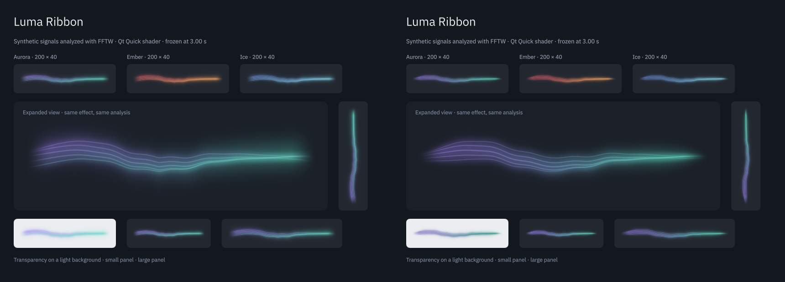
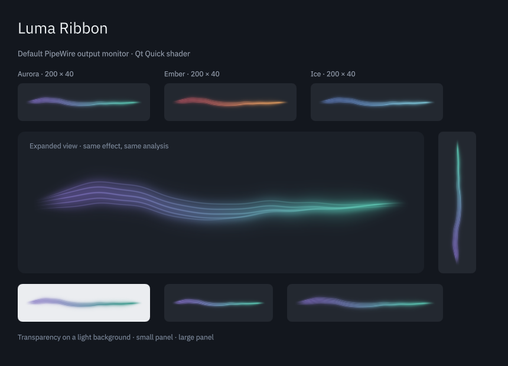

# Visual refinement

2026-09-05. This pass implements selected recommendations from the [visual peer review](visual-peer-review.md). Apple Design and Emil Design Engineering guided the work toward clearer light, restrained detail and smooth audio response. The first candidate made the ends too pointed; the final taper is gentler.

## Changes

| Before | After | Why |
| --- | --- | --- |
| The broad veil could float away from the filaments | The veil follows their weighted center and shares their color progression, `shaders/ribbon.frag:49` | Keeps the glow attached to one continuous ribbon |
| Ends faded but retained a wide profile | Strand spread and halo width narrow gently toward both ends, `shaders/ribbon.frag:46` | Reduces the rounded cap without ending in a sharp needle |
| Filaments had similar prominence and strong near-white highlights | A stronger central filament, quieter outer filaments and less whitening, `shaders/ribbon.frag:72` | Gives the shape a hierarchy while retaining five filaments and the same overall movement |
| Light backgrounds weakened the pastel colors | Each palette has deeper tints selected from the host's nominal background, `package/contents/ui/RibbonView.qml:17` | Improves visibility without a backing rectangle or minimum opacity |
| Attack ripples could form a central angular crease | A rounded distance joins the two outgoing waves, `shaders/ribbon.frag:37` | Keeps attacks visible while smoothing the point where the waves meet |

No audio acquisition, analysis, settings ranges, frame limit, palette selector or popup interaction changed. The simple renderer uses the same background-aware colors. Its curve and bounded eight-stroke drawing remain unchanged.

## Matched comparison

**Before on the left, after on the right.** Both captures use exactly the same synthetic PCM processed through FFTW, frozen after 3.00 seconds. The screenshot labels identify the synthetic input. The bottom-left sample in each gallery uses a light background.



A second matched comparison at 9.40 seconds checks a different phase and attack state. Both versions preserve the same underlying audio features and timing. The images and intermediate candidate remain in `build/evidence/refinement/`.

Repeating the final 3.00-second capture in a new process changed 62 of 533,200 pixels by at most one channel level out of 255. The comparison is stable at the scale used here, but is not bit-identical across processes.

The preview now accepts `--synthetic --at SECONDS`. It advances the existing generator and analyzer in 10 ms steps to the selected point, then holds the features and phase constant. The range is 0–30 seconds. This mode exists only in the verification tool; the installed widget always captures the real output monitor.

```sh
./build/luma-preview --synthetic --at 3 --capture /tmp/luma-reference.png
./build/luma-preview --synthetic --at 9.4 --capture /tmp/luma-other-phase.png
```

## Real audio and installation

The updated package and native plugin were compiled and installed under `/usr`. A fresh `plasmawindowed` process loaded the installed shader and rendered real audio without applet warnings. Its window was closed normally after inspection. A separate preview was captured with Spotify playing through the current default HDMI output:



The capture probe reported stereo 48 kHz, finite features, zero queue drops and engine release on exit. Spotify playback and output selection were not changed. The user's widget IDs and saved settings remain Aurora, intensity 120%, sensitivity 150%, 60 FPS, reduced motion off, simple rendering off.

The existing panel can retain its previously loaded plugin and QML until the next normal login. The new rendering was verified in fresh processes. No desktop session or audio service was restarted to force a reload.

## Verification

| Check | Result |
| --- | --- |
| Full CMake build and qsb generation | Passed |
| CTest | 4/4 suites passed |
| View tests, normal backend and 125% scaling | 18 passed on each run |
| Software renderer | 17 passed; the shader-only travelling-ripple check was skipped intentionally |
| Palette adaptation | All three palettes in both renderers increase RGB distance from white after compositing by at least 20%, while preserving alpha exactly. This is a rendering regression metric, not a WCAG contrast rating |
| Theme changes and silence | Switching back restores the original pixels; silence is fully transparent on a light background |
| Attack crease regression | Failed with the previous shader and passed with the final shader. The measured local slope change dropped from 0.444 to 0.075 pixels at normal scale. The test also requires a visible ripple |
| Existing rendering checks | Palette/intensity behavior, phase wrap, fixed reduced motion, renderer switching, vertical layout, hidden-view suspension and silence checks passed |
| GUI update cadence | 32 updates in 1.1 seconds at 30 FPS, 64 at 60 FPS, and 65 for Canvas at 60 FPS on this machine |
| QML lint | RibbonView and preview passed without warnings |

The theme treatment uses the background color supplied by Kirigami. It does not sample wallpaper or arbitrary pixels behind a translucent panel, so unusually mismatched theme and wallpaper colors still need visual checking. The shader retains its fixed five-filament workload and premultiplied output. The weighted-center calculation adds a small constant-size computation, not another texture pass or blur.

This is a visual refinement with synthetic-frame comparisons, existing timing checks and real-audio captures. It is not a new end-to-end audio/video latency measurement or a GPU-driver compatibility study. The earlier hardware coverage limits in [verification](verification.md) still apply. The GLM and Gemini reviews predate these changes; their grades should not be presented as an independent approval of this new version.

**Verdict: Approve.** The final version keeps the calm, continuous appearance while improving light-background definition, connecting the glow to the filaments and smoothing the attack crease. Further changes should start with matched frames and preserve the panel's small-scale readability.
