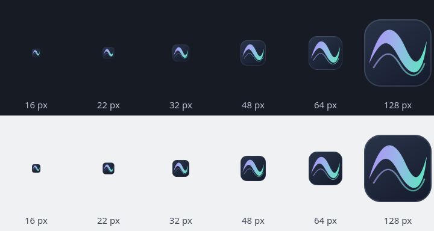

# Widget icon

The widget has a dedicated SVG icon, installed as `org.kde.plasma.lumaribbon` in the standard hicolor icon theme. A single curved band and a fine trailing filament use Aurora's violet and mint colors. The dark backing keeps the shape visible on both light and dark surfaces. It identifies Luma Ribbon in Plasma's widget picker and metadata-based dialogs.

| Before | After | Why |
| --- | --- | --- |
| The widget used the generic sound-settings icon. | A dedicated ribbon mark identifies Luma Ribbon. | It is easier to distinguish in the widget list. |
| The icon depended on the user's sound-settings artwork. | The name resolves through the icon theme, with the supplied hicolor SVG as fallback. | KDE can theme the icon while a default remains available. |
| There was no icon asset in the installation. | CMake installs the SVG and the manifest-based uninstaller removes that exact filename. | Installation and removal include the branding asset. |

The source is `icons/hicolor/scalable/apps/org.kde.plasma.lumaribbon.svg`, under GPL-3.0-or-later like the project. It contains vector paths and gradients, with no fonts, embedded bitmaps, filters or external resources. Both the package metadata and the generated native plugin metadata use the same icon name. The staged Plasma test environment includes the icon tree.

Checked on 2026-09-06 with Qt 6.11.2 and Plasma 6.7.4. Native `QIcon::fromTheme` lookup and rendering work at 16, 22, 32, 48, 64 and 128 pixels, with device pixel ratios 1, 1.25 and 2. The existing Plasma test covers applet creation, settings, popup and removal. The icon change does not alter audio or ribbon rendering.

The project builds successfully. The native Plasma test passes all three entries with both the staged package and the installed plugin. The installed plugin declares the new icon name, and theme lookup works without the staged data path. A full `DESTDIR` installation and uninstall removes all 72 manifest entries while preserving an unrelated icon next to this asset.

Implementation follows KDE's [widget icon metadata](https://develop.kde.org/docs/plasma/widget/properties/#icon), [icon theme guidance](https://develop.kde.org/hig/icons/) and [hicolor SVG installation convention](https://develop.kde.org/docs/getting-started/kirigami/platforms-windows/).

Local captures and installation checks are under `build/evidence/widget-icon/`. An already-open widget picker or configuration window may retain its previous metadata until reopened.
